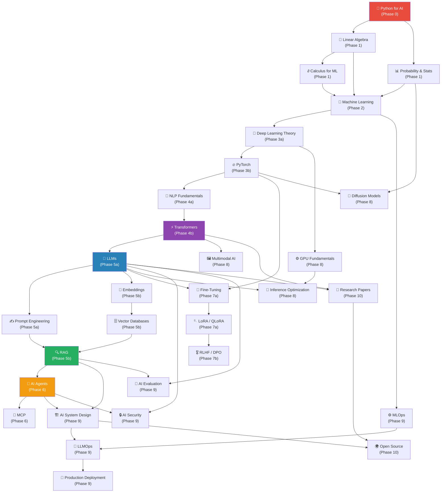

# Generative AI Engineer Roadmap
### Data Engineer → World-Class GenAI Engineer | 12–18 Months | 1–2 Hours/Day

> **Profile**: Data Engineer with Python (6/10), SQL (7/10), Java (7/10), Databricks, PySpark, Spark SQL, Kafka.  
> **Goal**: Expert-level Generative AI Engineer who understands *why* models work, not just how to call APIs.  
> **Start Date**: June 2026 | **Target**: End of 2027

---

## Table of Contents

- [Philosophy](#philosophy)
- [Your Starting Position](#your-starting-position)
- [Roadmap Overview](#roadmap-overview)
- [File Navigation](#file-navigation)
- [Dependency Graph](#dependency-graph)
- [Quick Reference: Topics by Label](#quick-reference-topics-by-label)
- [Your Databricks Advantage](#your-databricks-advantage)
- [Day 1 Action](#day-1-action)

---

## Philosophy

Most people learn AI from the **outside in** — copy API calls, paste LangChain code, ship demos. That produces developers who are fragile under pressure and cannot debug silent model failures.

This roadmap is built **inside out**:

```
Foundations → Theory → Implementation → Production
```

**Three rules that define this path:**

1. **Implement before you use** — Build a neural network in NumPy before touching PyTorch. Build a transformer before using Hugging Face. The deep understanding this creates is the difference between the top 5% and everyone else.

2. **Math is your language** — You don't need PhD-level proofs. You need enough mathematical intuition to read papers, debug gradient issues, and design architectures. Do not skip the math phases.

3. **Your data engineering background is a superpower** — Kafka, PySpark, Databricks, and distributed systems knowledge is rare among ML engineers. Exploit this in Phases 5–9 to build things others cannot.

---

## Your Starting Position

| Skill | Current Level | AI Relevance | Priority |
|-------|:---:|--------------|:---:|
| Python | 6/10 | Critical — must reach 8.5/10 | 🔴 Week 1 |
| SQL | 7/10 | Feature engineering, analytics | 🟢 Leverage now |
| Java | 7/10 | Low relevance for AI path | ⚪ Deprioritize |
| Databricks | Strong | Large-scale ML pipelines | 🟢 Leverage Phase 5+ |
| PySpark | Strong | Distributed ML data prep | 🟢 Leverage Phase 5+ |
| Kafka | Basic | Real-time AI, streaming RAG | 🟡 Leverage Phase 6+ |
| Machine Learning | 0/10 | Everything | 🔴 Build from scratch |
| Deep Learning | 0/10 | Everything | 🔴 Build from scratch |
| LLMs / GenAI | 0/10 | Everything | 🔴 Build from scratch |

---

## Roadmap Overview

| File | Phase | Topics | Months | Difficulty | Label |
|------|-------|--------|:---:|:---:|:---:|
| [01_Phase0](./01_Phase0_CS_Fundamentals_and_Python.md) | **Phase 0** | CS Fundamentals + Python for AI | 1–2 | 3/10 | 🔴 Must Learn |
| [02_Phase1](./02_Phase1_Mathematics_for_ML.md) | **Phase 1** | Linear Algebra, Calculus, Probability | 2–4 | 6/10 | 🔴 Must Learn |
| [03_Phase2](./03_Phase2_Machine_Learning.md) | **Phase 2** | Classical Machine Learning | 4–6 | 6/10 | 🔴 Must Learn |
| [04_Phase3_Part1](./04_Phase3_Part1_Deep_Learning_Theory.md) | **Phase 3a** | Deep Learning Theory | 6–8 | 7/10 | 🔴 Must Learn |
| [04_Phase3_Part2](./04_Phase3_Part2_PyTorch.md) | **Phase 3b** | PyTorch | 7–9 | 6/10 | 🔴 Must Learn |
| [05_Phase4_Part1](./05_Phase4_Part1_NLP_Fundamentals.md) | **Phase 4a** | NLP Fundamentals | 9–10 | 6/10 | 🔴 Must Learn |
| [05_Phase4_Part2](./05_Phase4_Part2_Transformers.md) | **Phase 4b** | Transformers (deep dive) | 10–11 | 9/10 | 🔴 Must Learn |
| [06_Phase5_Part1](./06_Phase5_Part1_LLMs_and_Prompt_Engineering.md) | **Phase 5a** | LLMs + Prompt Engineering | 11–12 | 7/10 | 🔴 Must Learn |
| [06_Phase5_Part2](./06_Phase5_Part2_Embeddings_VectorDB_RAG.md) | **Phase 5b** | Embeddings + Vector DBs + RAG | 12–13 | 7/10 | 🔴 Must Learn |
| [07_Phase6](./07_Phase6_AI_Agents_and_MCP.md) | **Phase 6** | AI Agents + MCP | 13–14 | 7/10 | 🔴 Must Learn |
| [08_Phase7_Part1](./08_Phase7_Part1_FineTuning_and_LoRA.md) | **Phase 7a** | Fine-Tuning + LoRA/QLoRA | 14–15 | 8/10 | 🔴 Must Learn |
| [08_Phase7_Part2](./08_Phase7_Part2_RLHF_and_DPO.md) | **Phase 7b** | RLHF + DPO + Alignment | 15–16 | 9/10 | 🔴 Must Learn |
| [09_Phase8](./09_Phase8_Advanced_Topics.md) | **Phase 8** | Multimodal + Diffusion + GPU + CUDA + Inference Opt. | 14–16 | 9/10 | 🟡 Learn Later |
| [10_Phase9](./10_Phase9_Production_AI_Engineering.md) | **Phase 9** | AI System Design + MLOps + LLMOps + Security + Eval | 15–18 | 8/10 | 🔴 Must Learn |
| [11_Phase10](./11_Phase10_Research_and_OpenSource.md) | **Phase 10** | Research Papers + Open Source | Month 9+ | 8/10 | 🔵 Advanced |
| [12_Projects](./12_Projects_Beginner_to_Expert.md) | **Projects** | 30+ projects from beginner to production | Ongoing | 3–9/10 | 🔴 Must Do |
| [13_Study_Schedule](./13_Study_Schedule_18_Months.md) | **Schedule** | 18-month week-by-week plan | All | — | 🔴 Follow This |

---

## File Navigation

```
ai-roadmap/
├── 00_README.md                          ← You are here
├── 01_Phase0_CS_Fundamentals_and_Python.md
├── 02_Phase1_Mathematics_for_ML.md
├── 03_Phase2_Machine_Learning.md
├── 04_Phase3_Part1_Deep_Learning_Theory.md
├── 04_Phase3_Part2_PyTorch.md
├── 05_Phase4_Part1_NLP_Fundamentals.md
├── 05_Phase4_Part2_Transformers.md
├── 06_Phase5_Part1_LLMs_and_Prompt_Engineering.md
├── 06_Phase5_Part2_Embeddings_VectorDB_RAG.md
├── 07_Phase6_AI_Agents_and_MCP.md
├── 08_Phase7_Part1_FineTuning_and_LoRA.md
├── 08_Phase7_Part2_RLHF_and_DPO.md
├── 09_Phase8_Advanced_Topics.md
├── 10_Phase9_Production_AI_Engineering.md
├── 11_Phase10_Research_and_OpenSource.md
├── 12_Projects_Beginner_to_Expert.md
└── 13_Study_Schedule_18_Months.md
```

---

## Dependency Graph



---

## Quick Reference: Topics by Label

### 🔴 Must Learn (Core Path)
- Python for AI, NumPy, async Python
- Linear Algebra, Calculus, Probability
- Classical Machine Learning
- Deep Learning Theory + Backpropagation
- PyTorch
- NLP Fundamentals
- **Transformers (most important topic)**
- LLMs, Prompt Engineering
- Embeddings, Vector Databases, RAG
- AI Agents, MCP
- Fine-Tuning, LoRA, QLoRA
- AI System Design, MLOps, LLMOps
- AI Security, AI Evaluation

### 🟡 Learn Later (Important but not blocking)
- Multimodal AI
- Diffusion Models
- GPU Fundamentals + CUDA
- Inference Optimization
- RLHF / DPO (after LoRA is solid)

### 🔵 Advanced (From Month 9 onwards, ongoing)
- Reading Research Papers
- Open Source Contributions

### ⚪ Skip / Low Priority
- GANs (largely superseded by diffusion)
- Java ML libraries
- Computer Vision depth (unless targeting CV roles)

---

## Topics You Can Safely Skip Initially

| Topic | Skip Until | Reason |
|-------|-----------|--------|
| CUDA programming depth | Month 16 | Need LLM/DL foundation first |
| Diffusion models | Month 15 | Not blocking for LLM engineering |
| Multimodal depth | Month 15 | Foundation first |
| Advanced RL theory (beyond DPO) | Month 15+ | Need RLHF context first |
| GANs | Optional | Diffusion has replaced GANs |
| Computer Vision depth | Optional | Unless targeting CV role |
| Java ML libraries | Skip entirely | Not relevant to this path |

---

## Your Databricks Advantage

Your existing Databricks + PySpark + Kafka experience directly accelerates these phases:

| Your Skill | Where It Becomes a Superpower |
|-----------|-------------------------------|
| **Databricks** | Phase 5+: Large-scale LLM inference pipelines; Phase 9: MLOps with MLflow, Feature Store |
| **PySpark** | Phase 5+: Distributed data prep for fine-tuning datasets; batch inference at scale |
| **Kafka** | Phase 6+: Real-time AI inference pipelines; streaming RAG architectures |
| **SQL (7/10)** | Phase 2: Feature engineering; Phase 6: Text-to-SQL agents |
| **Data Engineering mindset** | Phase 9: Production reliability, data quality, pipeline thinking |

> **Unique project opportunity** (Month 13): Build an MCP server that exposes your Databricks tables and Kafka topics to LLM agents. Very few engineers in the world can currently build this.

---

## Day 1 Action

**Tomorrow morning, open this link:**  
[3Blue1Brown — Essence of Linear Algebra, Chapter 1](https://www.youtube.com/watch?v=fNk_zzaMoSs&list=PLZHQObOWTQDPD3MizzM2xVFitgF8hE_ab)

Watch Chapters 1–3 (35 minutes total). Then open a Jupyter notebook and implement:

```python
import numpy as np

# Implement dot product WITHOUT using np.dot
def dot_product(v1, v2):
    """Your implementation here"""
    pass

# Implement matrix multiplication WITHOUT using @
def matmul(A, B):
    """Your implementation here"""
    pass

# Verify against NumPy
v1 = np.array([1, 2, 3])
v2 = np.array([4, 5, 6])
A = np.array([[1, 2], [3, 4]])
B = np.array([[5, 6], [7, 8]])

assert dot_product(v1, v2) == np.dot(v1, v2)
assert np.allclose(matmul(A, B), A @ B)
print("All assertions passed!")
```

**Why this and not Python?**  
Your Python (6/10) is good enough to start. But every concept in the next 18 months — attention, embeddings, LoRA, backpropagation — is linear algebra. Starting here means every subsequent topic clicks faster. The 35 minutes you spend watching Chapters 1–3 will save you hours of confusion when you reach transformers.

---

## Recommended VS Code Extensions for This Journey

```json
{
  "recommendations": [
    "ms-python.python",
    "ms-toolsai.jupyter",
    "bierner.markdown-mermaid",
    "yzhang.markdown-all-in-one",
    "ms-python.vscode-pylance",
    "njpwerner.autodocstring",
    "streetsidesoftware.code-spell-checker"
  ]
}
```

---

*Last updated: June 2026 | Roadmap designed for 1–2 hours/day study*
