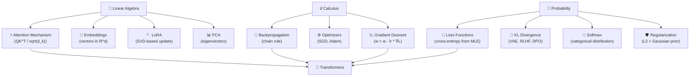

# Phase 1: Mathematics for Machine Learning
**Months 2–4 | Difficulty: 6/10 | Label: 🔴 Must Learn**

> **Previous Phase**: [Phase 0 — CS Fundamentals & Python for AI](./01_Phase0_CS_Fundamentals_and_Python.md)  
> **Next Phase**: [Phase 2 — Machine Learning](./03_Phase2_Machine_Learning.md)

---

## Table of Contents

- [Phase Overview](#phase-overview)
- [Why Mathematics?](#why-mathematics)
- [Topic 1: Linear Algebra](#topic-1-linear-algebra)
  - [Vectors and Geometric Intuition](#vectors-and-geometric-intuition)
  - [Matrices as Transformations](#matrices-as-transformations)
  - [Eigenvalues and Eigenvectors](#eigenvalues-and-eigenvectors)
  - [Singular Value Decomposition (SVD)](#singular-value-decomposition-svd)
  - [Linear Algebra in AI — Direct Connections](#linear-algebra-in-ai--direct-connections)
  - [Resources](#linear-algebra-resources)
  - [Practice](#linear-algebra-practice)
  - [Mastery Checklist](#linear-algebra-mastery-checklist)
- [Topic 2: Calculus for ML](#topic-2-calculus-for-ml)
  - [Derivatives and Their Meaning](#derivatives-and-their-meaning)
  - [The Chain Rule IS Backpropagation](#the-chain-rule-is-backpropagation)
  - [Computational Graphs](#computational-graphs)
  - [Gradient Descent Derivation](#gradient-descent-derivation)
  - [Resources](#calculus-resources)
  - [Practice](#calculus-practice)
  - [Mastery Checklist](#calculus-mastery-checklist)
- [Topic 3: Probability & Statistics](#topic-3-probability--statistics)
  - [Probability Distributions](#probability-distributions)
  - [Maximum Likelihood Estimation](#maximum-likelihood-estimation)
  - [Information Theory](#information-theory)
  - [Bayesian Thinking](#bayesian-thinking)
  - [Resources](#probability-resources)
  - [Practice](#probability-practice)
  - [Mastery Checklist](#probability-mastery-checklist)
- [Math to AI Connections Map](#math-to-ai-connections-map)
- [Common Mistakes](#common-mistakes)
- [Week-by-Week Plan](#week-by-week-plan)
- [Interview Importance](#interview-importance)

---

## Phase Overview

| Attribute | Details |
|-----------|---------|
| **Duration** | Months 2–4 (8 weeks) |
| **Daily Time** | 1–2 hours |
| **Difficulty** | 6/10 |
| **Label** | 🔴 Must Learn |
| **Prerequisites** | Phase 0 complete (NumPy fluency is essential) |
| **Outcome** | Geometric intuition for vectors, matrices, gradients, and probability; can derive cross-entropy loss |

### Three Pillars

```
Linear Algebra       Calculus             Probability
─────────────       ──────────           ───────────
Vectors/Matrices     Derivatives          Distributions
Eigenvalues          Chain Rule           MLE/MAP
SVD                  Gradient Descent     KL Divergence
Transformations      Backpropagation      Cross-Entropy
```

---

## Why Mathematics?

Most AI engineers hit a ceiling at 6–12 months because they skipped the math. The ceiling looks like:

- "My model isn't learning — I don't know why"
- "The paper says to minimize KL divergence but I don't know what that means"
- "I can't read this architecture paper — too many Greek letters"
- "I copied the RLHF code but can't debug it"

You don't need PhD-level mathematics. You need **working understanding**: enough to:

1. Read a research paper and understand the equations
2. Debug training problems using gradient intuitions
3. Design architectures by reasoning about matrix dimensions
4. Understand why loss functions work the way they do

**The goal is intuition first, formal proof second.**

---

## Topic 1: Linear Algebra

### Why Linear Algebra Exists

Every neural network is a sequence of matrix operations:

```
Input → Linear(W₁, b₁) → Activation → Linear(W₂, b₂) → ... → Output
```

A transformer's attention mechanism is entirely matrix operations:

$$\text{Attention}(Q, K, V) = \text{softmax}\left(\frac{QK^T}{\sqrt{d_k}}\right)V$$

Embeddings are vectors in high-dimensional space. LoRA (the fine-tuning technique you'll use in Phase 7) is literally SVD. **Linear algebra is the language AI is written in.**

### Vectors and Geometric Intuition

Do not just memorize operations. Build the geometric picture.

| Concept | Formula | What It Means Geometrically |
|---------|---------|----------------------------|
| Vector addition | $\vec{a} + \vec{b}$ | Moving in one direction then another |
| Scalar multiplication | $c\vec{a}$ | Stretching or shrinking a direction |
| Dot product | $\vec{a} \cdot \vec{b} = \|\vec{a}\|\|\vec{b}\|\cos\theta$ | How much two vectors point the same way |
| L2 norm | $\|\vec{a}\| = \sqrt{\sum a_i^2}$ | Length of a vector |
| Cosine similarity | $\frac{\vec{a} \cdot \vec{b}}{\|\vec{a}\|\|\vec{b}\|}$ | Similarity ignoring magnitude |
| Projection | $\text{proj}_{\vec{b}}\vec{a} = \frac{\vec{a}\cdot\vec{b}}{\|\vec{b}\|^2}\vec{b}$ | Shadow of $\vec{a}$ onto $\vec{b}$ |

**The dot product is everywhere in AI because it measures similarity.** When an LLM computes attention, it's computing dot products between query and key vectors to find which tokens "attend to" which others.

```python
import numpy as np

# Geometric meaning of dot product
a = np.array([1, 0])     # points right
b = np.array([0, 1])     # points up  
c = np.array([1, 1]) / np.sqrt(2)  # points diagonally

print(np.dot(a, b))  # 0.0 — perpendicular, no similarity
print(np.dot(a, a))  # 1.0 — identical direction, max similarity (when normalized)
print(np.dot(a, c))  # 0.707 — 45 degrees apart

# This is EXACTLY what attention does with query/key vectors
# High dot product = high attention weight = "these tokens are related"
```

### Matrices as Transformations

A matrix is a **linear transformation** — it rotates, scales, shears, or projects a vector space.

```python
import numpy as np
import matplotlib.pyplot as plt

# A 2x2 matrix transforms 2D vectors
A = np.array([[2, 0],
              [0, 0.5]])  # Scales x by 2, y by 0.5

# What happens to a unit circle under this transformation?
theta = np.linspace(0, 2*np.pi, 100)
circle = np.array([np.cos(theta), np.sin(theta)])  # shape (2, 100)

transformed = A @ circle  # Apply transformation

plt.figure(figsize=(10, 5))
plt.subplot(1, 2, 1); plt.plot(circle[0], circle[1]); plt.title("Before: Unit Circle")
plt.subplot(1, 2, 2); plt.plot(transformed[0], transformed[1]); plt.title("After: Scaled Ellipse")
plt.show()

# In a neural network:
# W (weight matrix) transforms input vectors into a new space
# Each layer is saying: "represent this input in a new coordinate system
# where the task is easier to solve"
```

### Eigenvalues and Eigenvectors

An eigenvector of matrix $A$ is a vector that **only gets scaled** (not rotated) by the transformation:

$$A\vec{v} = \lambda\vec{v}$$

Where $\lambda$ is the eigenvalue (scaling factor).

**Why it matters for AI**:
- PCA uses eigenvectors to find the directions of maximum variance
- Understanding attention: the principal directions of the attention matrix tell you what information is preserved
- Stability analysis of training: eigenvalues of the Hessian tell you about the loss landscape

```python
import numpy as np

# Compute eigenvalues and eigenvectors
A = np.array([[3, 1],
              [1, 3]])

eigenvalues, eigenvectors = np.linalg.eig(A)
print("Eigenvalues:", eigenvalues)       # [4, 2]
print("Eigenvectors:\n", eigenvectors)  # columns are eigenvectors

# Verify: A @ v = lambda * v
v0 = eigenvectors[:, 0]   # first eigenvector
lam0 = eigenvalues[0]     # first eigenvalue
print(np.allclose(A @ v0, lam0 * v0))   # True

# Eigendecomposition: A = Q @ diag(lambda) @ Q^{-1}
Q = eigenvectors
Lambda = np.diag(eigenvalues)
A_reconstructed = Q @ Lambda @ np.linalg.inv(Q)
print(np.allclose(A, A_reconstructed))  # True
```

### Singular Value Decomposition (SVD)

SVD is the most important matrix decomposition in AI. It generalizes eigendecomposition to non-square matrices.

$$A = U \Sigma V^T$$

Where:
- $U$: left singular vectors (column space)
- $\Sigma$: singular values (diagonal, importance of each dimension)
- $V^T$: right singular vectors (row space)

**Direct connection to LoRA**: LoRA (Low-Rank Adaptation) works by assuming that weight updates have low intrinsic rank. Instead of updating $W$ (large matrix), you update $\Delta W = BA$ where $B$ and $A$ are small matrices. This is exactly the low-rank approximation that SVD enables.

```python
import numpy as np
import matplotlib.pyplot as plt

# SVD of an image (grayscale)
# Each singular value represents a "layer" of information
# High singular values = important structure; low = noise

# Simulate with random matrix
A = np.random.randn(50, 100)

U, sigma, Vt = np.linalg.svd(A, full_matrices=False)
print(f"U shape: {U.shape}")      # (50, 50)
print(f"sigma shape: {sigma.shape}")  # (50,) — singular values in descending order
print(f"Vt shape: {Vt.shape}")    # (50, 100)

# Low-rank approximation: keep only top-r singular values
def low_rank_approx(A, r):
    """Approximate A using only rank r. This is the core of LoRA."""
    U, sigma, Vt = np.linalg.svd(A, full_matrices=False)
    # Keep only top-r components
    return U[:, :r] @ np.diag(sigma[:r]) @ Vt[:r, :]

A_rank5 = low_rank_approx(A, r=5)
A_rank20 = low_rank_approx(A, r=20)

# Reconstruction error
print(f"Rank-5 error: {np.linalg.norm(A - A_rank5):.2f}")
print(f"Rank-20 error: {np.linalg.norm(A - A_rank20):.2f}")
print(f"Parameters in A: {A.size}")
print(f"Parameters in rank-5: {5 * (50 + 100)}")  # U*5 + Vt*5

# THIS is why LoRA works: a 50x100 weight update matrix (5000 params)
# can be approximated by two small matrices (750 params) with minimal loss
```

### Linear Algebra in AI — Direct Connections

| Linear Algebra Concept | Where It Appears in AI |
|------------------------|------------------------|
| Matrix multiplication | Every neural network forward pass |
| Dot product | Attention mechanism, cosine similarity |
| Transpose | QK^T in attention |
| Eigendecomposition | PCA, understanding loss landscape |
| SVD | LoRA/QLoRA fine-tuning, compression |
| Change of basis | What embeddings fundamentally are |
| Orthogonality | Dropout, initialization strategies |
| Rank | LoRA intrinsic rank hypothesis |
| Determinant | Normalizing flows, change of variables |
| Trace | Regularization terms |

---

### Linear Algebra Resources

| Rank | Resource | Type | Cost | Why |
|------|----------|------|------|-----|
| 1 | [3Blue1Brown — Essence of Linear Algebra](https://www.youtube.com/playlist?list=PLZHQObOWTQDPD3MizzM2xVFitgF8hE_ab) | YouTube | Free | **Watch first, before anything else.** 15 short videos. Builds geometric intuition that textbooks never give. |
| 2 | [Mathematics for Machine Learning book](https://mml-book.github.io/) (Deisenroth, Faisal, Ong) | Book | Free PDF | Written specifically for ML practitioners. Chapters 2–4 cover linear algebra perfectly. |
| 3 | [MIT 18.06 Gilbert Strang](https://www.youtube.com/playlist?list=PLE7DDD91010BC51F8) | YouTube | Free | Deep, rigorous. Watch after 3Blue1Brown for depth. |
| 4 | [Fast.ai Computational Linear Algebra](https://github.com/fastai/numerical-linear-algebra) | Course | Free | Practical, code-first. Uses real AI applications (NLP, recommendation). |
| 5 | Linear Algebra and Its Applications (Gilbert Strang) | Book | ~$100 | The classic textbook. Use as reference, not primary source. |

**Best YouTube**: 3Blue1Brown — non-negotiable. Watch all 15 videos before opening a textbook.

---

### Linear Algebra Practice

```python
# Practice Problem Set — implement all of these

import numpy as np

# 1. Gram-Schmidt orthogonalization
# Why: understanding orthogonal bases; used in QR decomposition; appears in training
def gram_schmidt(vectors: np.ndarray) -> np.ndarray:
    """Make a set of vectors orthonormal."""
    pass

# 2. Power iteration for dominant eigenvector
# Why: efficient way to find principal direction; used in PageRank, PCA
def power_iteration(A: np.ndarray, n_iterations: int = 100) -> tuple:
    """Find the dominant eigenvalue and eigenvector."""
    pass

# 3. PCA from scratch (revisit from Phase 0, now with full understanding)
def pca_full(X: np.ndarray, n_components: int) -> dict:
    """
    Full PCA implementation.
    Return: {
        'projected': projected data,
        'components': principal components (eigenvectors),
        'explained_variance': eigenvalues / sum(eigenvalues),
        'reconstruction': reconstructed data from components
    }
    """
    pass

# 4. Cosine similarity matrix (vectorized)
def cosine_similarity_matrix(A: np.ndarray) -> np.ndarray:
    """
    Compute NxN cosine similarity matrix for N vectors.
    This is how vector database search works internally.
    """
    pass

# 5. Low-rank approximation error vs. rank
# Implement and plot how approximation error decreases as rank increases
def plot_rank_approximation_error(A: np.ndarray, max_rank: int):
    """Show the "elbow" in approximation error — helps choose LoRA rank."""
    pass
```

### Linear Algebra Mastery Checklist

- [ ] Can explain dot product geometrically in 30 seconds
- [ ] Can multiply two matrices and explain what the result represents geometrically
- [ ] Understands why matrix multiply is not commutative (AB ≠ BA in general)
- [ ] Can compute eigenvalues/eigenvectors of a 2x2 matrix by hand
- [ ] Understands SVD conceptually and can implement low-rank approximation
- [ ] Implemented PCA from scratch (eigendecomposition path)
- [ ] Can explain why LoRA works using SVD concepts
- [ ] Watched all 15 3Blue1Brown Essence of Linear Algebra videos
- [ ] Completed Chapters 2–4 of MML book with exercises

---

## Topic 2: Calculus for ML

### Why Calculus for ML Exists

Neural networks learn by adjusting their weights to minimize a loss function. This adjustment is done using **gradient descent**:

$$w \leftarrow w - \eta \cdot \frac{\partial \mathcal{L}}{\partial w}$$

The partial derivative $\frac{\partial \mathcal{L}}{\partial w}$ tells us: *if we increase weight $w$ by a tiny amount, how much does the loss increase?* If the derivative is positive, we should decrease $w$. If negative, increase $w$.

**Backpropagation** — the algorithm that trains every neural network — is just the chain rule of calculus applied systematically to a computation graph. You cannot deeply understand training without this.

### Derivatives and Their Meaning

| Concept | Formula | Meaning in AI |
|---------|---------|---------------|
| Derivative | $f'(x) = \lim_{h\to 0}\frac{f(x+h)-f(x)}{h}$ | Rate of change of loss with respect to one weight |
| Partial derivative | $\frac{\partial f}{\partial x_i}$ | Rate of change with respect to one weight, holding others constant |
| Gradient | $\nabla f = [\frac{\partial f}{\partial x_1}, ..., \frac{\partial f}{\partial x_n}]$ | Vector of all partial derivatives — direction of steepest ascent |
| Jacobian | $J_{ij} = \frac{\partial f_i}{\partial x_j}$ | Matrix of partial derivatives for vector-valued functions |
| Hessian | $H_{ij} = \frac{\partial^2 f}{\partial x_i \partial x_j}$ | Matrix of second derivatives — curvature of loss landscape |

```python
import numpy as np

# Numerical gradient (approximation) — useful for debugging
def numerical_gradient(f, x, h=1e-5):
    """
    Approximate gradient using finite differences.
    Use this to VERIFY your analytical gradients during implementation.
    """
    grad = np.zeros_like(x)
    for i in range(x.size):
        x_plus = x.copy()
        x_minus = x.copy()
        x_plus.flat[i] += h
        x_minus.flat[i] -= h
        grad.flat[i] = (f(x_plus) - f(x_minus)) / (2 * h)
    return grad

# Example: gradient of MSE loss
def mse_loss(y_pred, y_true):
    return np.mean((y_pred - y_true) ** 2)

y_pred = np.array([1.0, 2.0, 3.0])
y_true = np.array([1.5, 2.5, 3.5])

# Analytical gradient of MSE w.r.t. y_pred: 2(y_pred - y_true) / N
analytical_grad = 2 * (y_pred - y_true) / len(y_pred)
numerical_grad = numerical_gradient(lambda p: mse_loss(p, y_true), y_pred)

print("Analytical:", analytical_grad)
print("Numerical: ", numerical_grad)
print("Match:", np.allclose(analytical_grad, numerical_grad, atol=1e-6))  # True
```

### The Chain Rule IS Backpropagation

The chain rule states: if $z = f(g(x))$, then $\frac{dz}{dx} = \frac{dz}{dy} \cdot \frac{dy}{dx}$ where $y = g(x)$.

In a neural network with layers $L_1 \to L_2 \to L_3 \to \text{Loss}$:

$$\frac{\partial \text{Loss}}{\partial W_1} = \frac{\partial \text{Loss}}{\partial L_3} \cdot \frac{\partial L_3}{\partial L_2} \cdot \frac{\partial L_2}{\partial L_1} \cdot \frac{\partial L_1}{\partial W_1}$$

This is backpropagation: multiply gradients backwards through the network.

```python
import numpy as np

# Implementing backprop from scratch for a simple 2-layer network
# This is the most important exercise in the entire roadmap

class TwoLayerNet:
    def __init__(self, input_size, hidden_size, output_size):
        # Xavier initialization
        self.W1 = np.random.randn(input_size, hidden_size) * np.sqrt(2.0 / input_size)
        self.b1 = np.zeros(hidden_size)
        self.W2 = np.random.randn(hidden_size, output_size) * np.sqrt(2.0 / hidden_size)
        self.b2 = np.zeros(output_size)
        
        # Cache for backward pass
        self.cache = {}
    
    def relu(self, x):
        return np.maximum(0, x)
    
    def relu_gradient(self, x):
        return (x > 0).astype(float)  # 1 where x > 0, else 0
    
    def forward(self, X):
        """Forward pass: X -> hidden layer -> output"""
        # Layer 1
        z1 = X @ self.W1 + self.b1           # Linear: (N, input) -> (N, hidden)
        a1 = self.relu(z1)                    # Activation
        
        # Layer 2
        z2 = a1 @ self.W2 + self.b2          # Linear: (N, hidden) -> (N, output)
        
        # Store for backward pass
        self.cache = {'X': X, 'z1': z1, 'a1': a1, 'z2': z2}
        return z2
    
    def mse_loss(self, y_pred, y_true):
        N = y_pred.shape[0]
        loss = np.sum((y_pred - y_true) ** 2) / N
        # Gradient of loss w.r.t. y_pred
        dloss_dyhat = 2 * (y_pred - y_true) / N
        return loss, dloss_dyhat
    
    def backward(self, dloss_dyhat):
        """Backward pass: compute gradients using chain rule"""
        X = self.cache['X']
        z1 = self.cache['z1']
        a1 = self.cache['a1']
        N = X.shape[0]
        
        # Gradient through Layer 2
        # z2 = a1 @ W2 + b2
        # dL/dW2 = a1.T @ dL/dz2
        dz2 = dloss_dyhat                         # (N, output)
        dW2 = a1.T @ dz2                          # (hidden, output)
        db2 = dz2.sum(axis=0)                     # (output,)
        da1 = dz2 @ self.W2.T                     # (N, hidden)
        
        # Gradient through ReLU activation
        # dL/dz1 = dL/da1 * da1/dz1 = dL/da1 * relu'(z1)
        dz1 = da1 * self.relu_gradient(z1)        # (N, hidden)
        
        # Gradient through Layer 1
        # z1 = X @ W1 + b1
        dW1 = X.T @ dz1                           # (input, hidden)
        db1 = dz1.sum(axis=0)                     # (hidden,)
        
        return {'dW1': dW1, 'db1': db1, 'dW2': dW2, 'db2': db2}
    
    def update(self, gradients, lr=0.01):
        """Gradient descent step"""
        self.W1 -= lr * gradients['dW1']
        self.b1 -= lr * gradients['db1']
        self.W2 -= lr * gradients['dW2']
        self.b2 -= lr * gradients['db2']

# Training loop
model = TwoLayerNet(input_size=2, hidden_size=10, output_size=1)
X = np.random.randn(100, 2)
y = (X[:, 0] + X[:, 1] > 0).astype(float).reshape(-1, 1)

for epoch in range(1000):
    y_pred = model.forward(X)
    loss, dloss = model.mse_loss(y_pred, y)
    gradients = model.backward(dloss)
    model.update(gradients, lr=0.01)
    if epoch % 100 == 0:
        print(f"Epoch {epoch}: Loss = {loss:.4f}")
```

### Computational Graphs

Every neural network is a directed acyclic graph (DAG) of operations. PyTorch builds this graph dynamically during the forward pass and traverses it backwards for gradient computation.

```
X → [multiply W1] → [add b1] → [ReLU] → [multiply W2] → [add b2] → ŷ
                                                                     ↓
                                                               [MSE Loss] → L
```

```python
# Understand how autograd works conceptually
# This is what PyTorch's autograd engine does internally

class Tensor:
    """Simplified tensor with autograd — concept illustration"""
    def __init__(self, data, requires_grad=False):
        self.data = np.array(data, dtype=float)
        self.requires_grad = requires_grad
        self.grad = None
        self._backward = lambda: None  # function to compute gradient
        self._prev = set()             # parent tensors in the graph
    
    def __mul__(self, other):
        out = Tensor(self.data * other.data)
        out._prev = {self, other}
        
        def _backward():
            # Chain rule: d(a*b)/da = b, d(a*b)/db = a
            if self.requires_grad:
                self.grad = (self.grad or 0) + out.grad * other.data
            if other.requires_grad:
                other.grad = (other.grad or 0) + out.grad * self.data
        
        out._backward = _backward
        return out
    
    def backward(self):
        # Topological sort, then call _backward() in reverse order
        topo = []
        visited = set()
        def build_topo(v):
            if v not in visited:
                visited.add(v)
                for parent in v._prev:
                    build_topo(parent)
                topo.append(v)
        build_topo(self)
        
        self.grad = 1.0
        for node in reversed(topo):
            node._backward()

# Andrej Karpathy's micrograd implements this fully — study it after Phase 1
```

### Gradient Descent Derivation

```python
import numpy as np
import matplotlib.pyplot as plt

# Visual demonstration: why gradient descent minimizes loss

def loss_function(w):
    """Simple parabola: L(w) = (w - 3)^2"""
    return (w - 3) ** 2

def gradient(w):
    """Derivative of parabola: dL/dw = 2(w - 3)"""
    return 2 * (w - 3)

# Gradient descent from starting point w=0
w = 0.0
learning_rate = 0.1
history = [w]

for step in range(50):
    grad = gradient(w)
    w = w - learning_rate * grad   # gradient descent update
    history.append(w)

print(f"Final w: {w:.4f}")  # Should be close to 3.0

# Plot the journey
w_range = np.linspace(-1, 7, 100)
plt.figure(figsize=(10, 4))
plt.subplot(1, 2, 1)
plt.plot(w_range, loss_function(w_range))
plt.scatter(history[::5], [loss_function(w) for w in history[::5]], c='red', zorder=5)
plt.xlabel('w'); plt.ylabel('Loss'); plt.title('Gradient Descent on Parabola')

plt.subplot(1, 2, 2)
plt.plot([loss_function(w) for w in history])
plt.xlabel('Step'); plt.ylabel('Loss'); plt.title('Loss vs. Training Step')
plt.tight_layout(); plt.show()
```

### Calculus Resources

| Rank | Resource | Type | Cost | Why |
|------|----------|------|------|-----|
| 1 | [3Blue1Brown — Essence of Calculus](https://www.youtube.com/playlist?list=PLZHQObOWTQDMsr9K-rj53DwVRMYO3t5Yr) | YouTube | Free | Same quality as LA series. Geometric intuition for derivatives. Watch first. |
| 2 | [Mathematics for Machine Learning book](https://mml-book.github.io/) (Chapters 5–7) | Book | Free PDF | Directly applies calculus to ML optimization. Best ML-focused treatment. |
| 3 | [Khan Academy — Multivariable Calculus](https://www.khanacademy.org/math/multivariable-calculus) | Course | Free | Best for partial derivatives and gradients. Use as supplement. |
| 4 | [Andrej Karpathy — micrograd](https://www.youtube.com/watch?v=VMj-3S1tku0) | YouTube | Free | 2 hours. Build backpropagation from scratch. The most educational video in AI. |

**The micrograd video by Karpathy is non-negotiable.** Watch it after learning chain rule. It's 2 hours and will solidify everything about backpropagation.

---

### Calculus Practice

```python
# Exercise 1: Compute gradients analytically for these loss functions
# Then verify with numerical_gradient() from above

# a) MSE Loss: L = (1/N) sum((y_pred - y_true)^2)
# Compute: dL/d(y_pred)

# b) Cross-entropy Loss: L = -sum(y_true * log(y_pred))
# Compute: dL/d(y_pred)

# c) Binary cross-entropy with sigmoid: L = -y*log(σ(x)) - (1-y)*log(1-σ(x))
# Compute: dL/dx (hint: simplifies beautifully to σ(x) - y)

# Exercise 2: Implement micrograd (following Karpathy's tutorial)
# This is the most important coding exercise in this phase

# Exercise 3: Gradient check — verify your backprop implementation
def gradient_check(model, X, y, epsilon=1e-5):
    """
    Verify that your analytical gradients match numerical gradients.
    If they don't, your backprop has a bug.
    """
    pass

# Exercise 4: Visualize the loss landscape of a simple 2-parameter function
# L(w1, w2) = (w1 - 2)^2 + (w2 - 1)^2 + w1*w2
# Plot contours, plot gradient vectors, simulate gradient descent path
```

### Calculus Mastery Checklist

- [ ] Can compute partial derivatives of any ML loss function by hand
- [ ] Can explain the chain rule in terms of a computation graph
- [ ] Has implemented backpropagation for a 2-layer network from scratch (no PyTorch)
- [ ] Has watched Karpathy's micrograd video and re-implemented it
- [ ] Understands why gradient descent with too-high learning rate diverges
- [ ] Can explain what the Hessian tells you about the loss landscape
- [ ] Understands gradient vanishing/exploding at a mathematical level

---

## Topic 3: Probability & Statistics

### Why Probability Exists in ML

Machine learning is fundamentally about **uncertainty**. Every training example is noisy. Every prediction has uncertainty. Loss functions are derived from probabilistic principles. Key connections:

| ML Concept | Probabilistic Foundation |
|-----------|--------------------------|
| Cross-entropy loss | Maximizing likelihood of data given model |
| KL divergence | Measuring how different two distributions are |
| Softmax output | Categorical probability distribution |
| Dropout | Ensemble of models; Bayesian approximation |
| RLHF reward model | Learning human preference distribution |
| VAE | Variational inference |
| Diffusion models | Reverse-diffusion of Gaussian noise |

### Probability Distributions

```python
import numpy as np
import matplotlib.pyplot as plt
from scipy import stats

# The distributions you MUST know for AI

fig, axes = plt.subplots(2, 3, figsize=(15, 8))

# 1. Gaussian (Normal) distribution
# Used: weight initialization, noise, assumptions about errors
x = np.linspace(-4, 4, 100)
axes[0,0].plot(x, stats.norm.pdf(x, loc=0, scale=1))
axes[0,0].set_title('Gaussian N(0,1)\nUsed: weight init, noise')

# 2. Bernoulli distribution
# Used: binary classification (yes/no)
k = [0, 1]
p = 0.7  # probability of success
axes[0,1].bar(k, [1-p, p])
axes[0,1].set_title('Bernoulli(p=0.7)\nUsed: binary classification')

# 3. Categorical distribution (Multinomial with n=1)
# Used: language model outputs (probability over vocab)
probs = np.array([0.1, 0.3, 0.4, 0.15, 0.05])
axes[0,2].bar(range(5), probs)
axes[0,2].set_title('Categorical\nUsed: LLM next-token probs')

# 4. Uniform distribution
# Used: initialization, sampling
x = np.linspace(-1, 1, 100)
axes[1,0].plot(x, stats.uniform.pdf(x, loc=-1, scale=2))
axes[1,0].set_title('Uniform(-1,1)\nUsed: Xavier initialization')

# 5. KL Divergence visualization
x = np.linspace(-4, 4, 100)
p = stats.norm.pdf(x, 0, 1)   # true distribution
q = stats.norm.pdf(x, 1, 1.5) # approximate distribution
axes[1,1].plot(x, p, label='P (true)'); axes[1,1].plot(x, q, label='Q (approx)')
axes[1,1].fill_between(x, p, q, alpha=0.3)
axes[1,1].set_title('KL Divergence KL(P||Q)\nHow different are P and Q?')
axes[1,1].legend()

plt.tight_layout(); plt.show()
```

### Maximum Likelihood Estimation

**This is the most important probabilistic concept for understanding ML.**

MLE answers: *What parameters $\theta$ make the observed data most likely?*

$$\theta^* = \arg\max_\theta P(\text{data} \mid \theta) = \arg\max_\theta \prod_{i=1}^N P(x_i \mid \theta)$$

Since products of probabilities underflow numerically, we maximize the log-likelihood:

$$\theta^* = \arg\max_\theta \sum_{i=1}^N \log P(x_i \mid \theta)$$

**Deriving cross-entropy loss from MLE**:

For classification, model outputs probability $P(y=k \mid x) = \hat{p}_k$. Maximizing log-likelihood:

$$\arg\max \sum_i \log P(y_i \mid x_i) = \arg\max \sum_i \log \hat{p}_{y_i} = \arg\min \underbrace{-\sum_i \log \hat{p}_{y_i}}_{\text{Cross-Entropy Loss}}$$

Cross-entropy loss is **not** arbitrary — it is the direct result of maximizing the probability of the data under your model.

```python
import numpy as np

def cross_entropy_loss(y_pred_probs, y_true_indices):
    """
    y_pred_probs: (N, num_classes) — model output after softmax
    y_true_indices: (N,) — ground truth class indices
    
    Derived from MLE: maximize log P(y | x) = minimize -log P(y | x)
    """
    N = len(y_true_indices)
    # Select the probability for the true class
    correct_class_probs = y_pred_probs[np.arange(N), y_true_indices]
    # Average negative log-likelihood
    loss = -np.mean(np.log(correct_class_probs + 1e-10))  # +eps for stability
    return loss

# Example
y_pred = np.array([[0.7, 0.2, 0.1],   # predicts class 0 with 70% confidence
                   [0.1, 0.8, 0.1]])  # predicts class 1 with 80% confidence
y_true = np.array([0, 1])             # true labels
loss = cross_entropy_loss(y_pred, y_true)
print(f"Cross-entropy loss: {loss:.4f}")  # Should be low (~0.28) — good predictions

# Compare to wrong predictions
y_pred_wrong = np.array([[0.1, 0.4, 0.5],  # wrongly predicts class 2
                         [0.7, 0.1, 0.2]])  # wrongly predicts class 0
loss_wrong = cross_entropy_loss(y_pred_wrong, y_true)
print(f"Loss with wrong predictions: {loss_wrong:.4f}")  # Should be high
```

### Information Theory

| Concept | Formula | Meaning in AI |
|---------|---------|---------------|
| Entropy | $H(P) = -\sum_i p_i \log p_i$ | Average information in a distribution; max when uniform |
| Cross-Entropy | $H(P, Q) = -\sum_i p_i \log q_i$ | Info needed to encode P using Q; our loss function |
| KL Divergence | $D_{KL}(P \| Q) = \sum_i p_i \log\frac{p_i}{q_i}$ | How different Q is from P; used in RLHF, VAE |
| Mutual Information | $I(X;Y) = H(X) - H(X \mid Y)$ | How much Y tells us about X; feature selection |

**Key relationship**: $H(P, Q) = H(P) + D_{KL}(P \| Q)$

Cross-entropy = entropy of true distribution + KL divergence between true and predicted.  
When $P$ is fixed, minimizing cross-entropy = minimizing KL divergence = making predictions closer to true distribution.

```python
import numpy as np

def entropy(p: np.ndarray) -> float:
    """Shannon entropy of distribution p."""
    p = p[p > 0]  # avoid log(0)
    return -np.sum(p * np.log2(p))

def cross_entropy(p: np.ndarray, q: np.ndarray) -> float:
    """Cross-entropy H(P, Q). p=true, q=predicted."""
    q = np.clip(q, 1e-10, 1.0)  # numerical stability
    return -np.sum(p * np.log2(q))

def kl_divergence(p: np.ndarray, q: np.ndarray) -> float:
    """KL divergence KL(P||Q). Not symmetric!"""
    mask = p > 0
    return np.sum(p[mask] * np.log2(p[mask] / (q[mask] + 1e-10)))

# Verify: H(P,Q) = H(P) + KL(P||Q)
p = np.array([0.5, 0.3, 0.2])  # true distribution
q = np.array([0.4, 0.4, 0.2])  # predicted distribution

H_p = entropy(p)
H_pq = cross_entropy(p, q)
KL = kl_divergence(p, q)

print(f"H(P) = {H_p:.4f}")
print(f"H(P,Q) = {H_pq:.4f}")
print(f"KL(P||Q) = {KL:.4f}")
print(f"H(P) + KL(P||Q) = {H_p + KL:.4f}")
print(f"Match: {np.isclose(H_pq, H_p + KL)}")  # True
```

### Bayesian Thinking

Bayesian statistics updates beliefs with evidence:

$$P(\theta | \text{data}) = \frac{P(\text{data} | \theta) \cdot P(\theta)}{P(\text{data})}$$

- **Prior** $P(\theta)$: your belief before seeing data → weight regularization in neural networks
- **Likelihood** $P(\text{data}|\theta)$: how likely is the data given parameters
- **Posterior** $P(\theta|\text{data})$: updated belief after seeing data

**Why it matters**: L2 regularization is MAP estimation with a Gaussian prior on weights. Dropout is an approximation to Bayesian inference. Understanding this deepens your intuition for regularization.

---

### Probability Resources

| Rank | Resource | Type | Cost | Why |
|------|----------|------|------|-----|
| 1 | [StatQuest with Josh Starmer](https://www.youtube.com/@statquest) | YouTube | Free | Best visual explanations of stats/probability for ML. Watch videos on probability, distributions, MLE, KL divergence specifically. |
| 2 | [Harvard Stat 110 (Blitzstein)](https://www.youtube.com/playlist?list=PL2SOU6wwxB0uwwH80KTQ6ht66KWxbzTIo) | YouTube | Free | Rigorous probability course. Watch lectures 1–15 at minimum. |
| 3 | [Mathematics for ML book](https://mml-book.github.io/) (Chapter 6) | Book | Free PDF | Chapter 6 on probability is perfectly scoped for ML. |
| 4 | [Pattern Recognition and Machine Learning](https://www.microsoft.com/en-us/research/uploads/prod/2006/01/Bishop-Pattern-Recognition-and-Machine-Learning-2006.pdf) (Bishop) | Book | Free PDF | The probabilistic ML bible. Chapter 1–2 cover all needed probability. |

---

### Probability Practice

```python
# Exercise Set: Derive everything from first principles

# Exercise 1: Derive cross-entropy loss from MLE
# Write a proof (in comments) showing how minimizing CE = maximizing log-likelihood
# Then implement it and verify numerically.

# Exercise 2: Implement and compare KL divergences
# Show that KL(P||Q) ≠ KL(Q||P) — it's not symmetric
# Demonstrate what happens to KL when Q spreads out vs. collapses

# Exercise 3: Monte Carlo estimation
# Estimate pi using random sampling (classic demonstration of MC methods)
# This principle underlies MC sampling used in diffusion models and RLHF
def estimate_pi(n_samples: int) -> float:
    """Estimate π using Monte Carlo — points inside a unit circle."""
    x = np.random.uniform(-1, 1, n_samples)
    y = np.random.uniform(-1, 1, n_samples)
    inside_circle = (x**2 + y**2) <= 1.0
    return 4 * np.mean(inside_circle)

# Exercise 4: Central Limit Theorem demonstration
# Show empirically that the mean of many samples approaches Gaussian
# regardless of the original distribution

# Exercise 5: Bayes' Theorem applied to ML
# A binary classifier has 95% accuracy. The positive class is 5% of data.
# If model predicts positive, what's the actual probability it's positive?
# (This is the precision-recall tradeoff — critical for evaluating AI systems)
```

### Probability Mastery Checklist

- [ ] Can explain what a probability distribution is in plain English
- [ ] Understands what makes Gaussian distribution special (and why we use it)
- [ ] Can derive cross-entropy loss from MLE in writing
- [ ] Understands KL divergence geometrically and can compute it
- [ ] Can explain what softmax does probabilistically (converts logits to distribution)
- [ ] Understands the relationship: `H(P,Q) = H(P) + KL(P||Q)`
- [ ] Can explain why L2 regularization = MAP estimation with Gaussian prior
- [ ] Completed Chapter 6 of MML book

---

## Math to AI Connections Map



---

## Common Mistakes

| Mistake | Consequence | Fix |
|---------|-------------|-----|
| Memorizing formulas without geometric intuition | Hit ceiling at transformers/attention | Watch 3Blue1Brown first, always |
| Skipping MLE derivation of cross-entropy | Can't debug loss issues; can't read papers | Derive it yourself, on paper, before moving on |
| Treating KL divergence as abstract | Can't understand RLHF, VAE, DPO | Compute KL numerically; visualize distributions |
| Not implementing in NumPy | Understanding doesn't stick | Every concept: watch/read → implement → verify |
| Skipping eigendecomposition | Can't understand PCA, LoRA, attention math | Spend extra time here; it pays off in Phase 7 |
| Rushing through calculus | Can't debug training; can't implement backprop | The chain rule is the algorithm; internalize it |

---

## Week-by-Week Plan

| Week | Focus | Resource | Output |
|------|-------|----------|--------|
| **Week 1** | Linear Algebra: vectors, matrices, operations | 3Blue1Brown Episodes 1–8 | Geometric intuition; implement dot product, matmul |
| **Week 2** | Linear Algebra: eigenvalues, SVD, PCA | 3Blue1Brown 9–15 + MML Ch 2–3 | PCA from scratch; SVD low-rank demo |
| **Week 3** | Calculus: derivatives, partial derivatives, chain rule | 3Blue1Brown Calculus 1–6 + MML Ch 5 | Gradient by hand for 3 loss functions |
| **Week 4** | Calculus: backpropagation, gradient descent | Karpathy micrograd video + MML Ch 7 | Backprop from scratch for 2-layer net |
| **Week 5** | Probability: distributions, Bayes, MLE | StatQuest playlists + MML Ch 6 | MLE derivation of cross-entropy |
| **Week 6** | Probability: entropy, KL divergence, information theory | StatQuest + Bishop Ch 1 | Implement entropy, KL, cross-entropy |
| **Week 7** | Integration: put it all together | Build attention mechanism in NumPy | Working scaled dot-product attention |
| **Week 8** | Revision + Phase 2 preparation | Re-read key sections | All checklists complete; begin CS229 |

---

## Interview Importance

| Topic | Interview Frequency | Common Question |
|-------|:--:|-----------------|
| Dot product / cosine similarity | 🔴 High | "How does semantic search work?" |
| Gradient descent | 🔴 High | "Explain how neural networks learn" |
| Backpropagation | 🔴 High | "What is backprop and how does it use the chain rule?" |
| Cross-entropy derivation | 🟡 Medium | "Why do we use cross-entropy for classification?" |
| KL divergence | 🟡 Medium | "What is KL divergence? Where is it used in AI?" |
| SVD / low-rank | 🟡 Medium | "How does LoRA work mathematically?" |
| Softmax | 🔴 High | "What does softmax do? Why is it used?" |

---

## Moving to Phase 2

**Before proceeding to [Phase 2: Machine Learning](./03_Phase2_Machine_Learning.md), confirm:**

- [ ] Implemented PCA from scratch using eigendecomposition
- [ ] Implemented backpropagation for a 2-layer network from scratch
- [ ] Derived cross-entropy loss from MLE (written derivation)
- [ ] Implemented KL divergence and verified `H(P,Q) = H(P) + KL(P||Q)`
- [ ] Built scaled dot-product attention in NumPy
- [ ] Watched all 3Blue1Brown linear algebra + calculus series
- [ ] Watched Karpathy's micrograd video

**Why Phase 2 comes next**: Classical ML algorithms (linear regression, logistic regression, decision trees) are built directly on these math foundations. Phase 1 provides the mathematical language; Phase 2 applies it to learning from data.

---

## Phase Completion & Readiness Assessment

> Complete this assessment **before** moving to Phase 2. Mathematical fluency is non-negotiable — every phase from here builds on these foundations.

---

### 1. Knowledge Checklist

**Linear Algebra**
- [ ] Vectors: magnitude, direction, dot product, cross product
- [ ] Matrices: addition, multiplication, transpose, inverse
- [ ] Linear independence and rank of a matrix
- [ ] Eigenvalues and eigenvectors — geometric meaning and how to find them
- [ ] SVD: what the three matrices U, Σ, V^T represent geometrically
- [ ] PCA — derive it from eigendecomposition or SVD
- [ ] Why PCA is equivalent to low-rank approximation

**Calculus & Optimization**
- [ ] Derivatives: power rule, product rule, chain rule
- [ ] Partial derivatives and the gradient vector
- [ ] Jacobian matrix (vector-to-vector function derivatives)
- [ ] Hessian matrix (second derivatives, curvature)
- [ ] Gradient descent: the update rule and why it works
- [ ] SGD, Momentum, AdaGrad, RMSProp, Adam — update rules from memory
- [ ] Learning rate effects: too high (diverge) vs. too low (slow convergence)
- [ ] Why deep networks need careful learning rate schedules

**Probability & Statistics**
- [ ] Sample space, events, probability axioms
- [ ] Conditional probability and Bayes' theorem
- [ ] Probability distributions: Gaussian, Bernoulli, Categorical, Uniform, Poisson
- [ ] Expectation, variance, covariance, correlation
- [ ] MLE: maximum likelihood estimation from first principles
- [ ] MAP: maximum a posteriori — how the prior changes MLE
- [ ] KL divergence: formula, asymmetry, and connection to cross-entropy
- [ ] Central Limit Theorem and its role in batch statistics
- [ ] Hypothesis testing, p-values, confidence intervals

---

### 2. Practical Skills Checklist

- [ ] Implement matrix multiplication from scratch (no NumPy `@`) and verify it matches `np.matmul`
- [ ] Implement PCA from scratch using `np.linalg.eig` and verify against `sklearn.PCA`
- [ ] Implement gradient descent for linear regression from scratch and compare to analytical solution
- [ ] Implement the Adam optimizer from scratch (state: m, v, t)
- [ ] Derive and implement cross-entropy loss and its gradient
- [ ] Compute KL divergence between two Gaussian distributions analytically and numerically
- [ ] Implement MLE for a Gaussian distribution (derive mu and sigma from data)
- [ ] Implement SVD-based image compression and quantify the quality vs. rank tradeoff

---

### 3. Coding Challenges

**Challenge A — Linear Algebra from Scratch**
```python
# Implement the following using NumPy primitives only (no np.linalg.eig, np.linalg.svd):
# 1. Power iteration to find the dominant eigenvector of a symmetric matrix
# 2. QR decomposition using Gram-Schmidt orthogonalization
# 3. Verify: A = Q @ R where Q is orthogonal and R is upper triangular
# Hint: Use np.dot, np.outer, np.sqrt only.
```

**Challenge B — Gradient Descent**
```python
# Implement a general gradient descent optimizer class:
# - Supports SGD, Momentum, Adam
# - Takes a loss function f(params) and gradient function grad_f(params)
# - Runs for N steps, returns loss history
# Test it on: minimizing f(x,y) = (x-3)^2 + (y+1)^2 (should converge to x=3, y=-1)
# Plot: loss curve and 2D trajectory of (x,y) towards minimum
```

**Challenge C — Probability**
```python
# Without using scipy.stats:
# 1. Implement Gaussian PDF: p(x | mu, sigma)
# 2. Implement KL divergence between two Gaussians: KL(P || Q)
# 3. Implement log-likelihood of data under a Gaussian model
# 4. Implement MLE: given 1000 samples from an unknown Gaussian,
#    find mu and sigma that maximize the likelihood
# 5. Verify: your MLE mu/sigma should match np.mean/np.std of the samples
```

---

### 4. Mini Project

**SVD Image Compressor**: Build an interactive notebook that:
- Loads a grayscale image (e.g., a headshot)
- Applies SVD: `U, S, Vt = np.linalg.svd(image, full_matrices=False)`
- Reconstructs the image using the top k singular values (k = 1, 5, 10, 20, 50, 100)
- Plots the reconstruction quality (PSNR) vs. compression ratio
- Shows the "elbow" where adding more singular values stops helping significantly

**Why this matters**: This is exactly the math behind LoRA (Phase 7a). LoRA uses low-rank decomposition of weight matrices — you'll understand it deeply because you built this.

---

### 5. Capstone Project

**Gradient Descent from Scratch on Real Data**:
- Implement linear regression with L2 regularization using NumPy gradient descent
- Implement logistic regression (sigmoid + binary cross-entropy) using gradient descent
- Apply both to the California Housing and Census Income datasets respectively
- Compare convergence: SGD vs. Momentum vs. Adam (plot all three loss curves)
- Implement early stopping and learning rate decay
- Show final test metrics match or beat sklearn's defaults

---

### 6. Interview Questions

**Beginner**

1. **Q: What is the dot product and what does it measure geometrically?**
   A: The dot product of two vectors a·b = |a||b|cos(θ). It measures the projection of one vector onto another. When two vectors are orthogonal (perpendicular), their dot product is zero.

2. **Q: What is a matrix rank?**
   A: The rank of a matrix is the number of linearly independent rows (or columns). It equals the number of non-zero singular values. A full-rank matrix has an inverse; a rank-deficient matrix is singular.

3. **Q: What is the gradient and why does gradient descent subtract it?**
   A: The gradient is a vector pointing in the direction of steepest ascent. We subtract it (times learning rate) to move towards the minimum of the loss function.

4. **Q: What is the difference between mean and expectation?**
   A: The sample mean is the average of observed data. The expectation E[X] is the theoretical average over the probability distribution — a property of the distribution, not the data.

5. **Q: What is Bayes' theorem?**
   A: P(A|B) = P(B|A) · P(A) / P(B). In ML: P(model|data) = P(data|model) · P(model) / P(data) — posterior ∝ likelihood × prior. This is the foundation of Bayesian ML.

6. **Q: What is the difference between variance and standard deviation?**
   A: Variance is the average squared deviation from the mean: Var(X) = E[(X-μ)²]. Standard deviation is the square root of variance, expressed in the same units as the data.

7. **Q: What is cross-entropy loss and why is it used for classification?**
   A: Cross-entropy: H(y, ŷ) = -Σ y_i log(ŷ_i). For binary: -[y log p + (1-y) log(1-p)]. It is derived from MLE — minimizing cross-entropy is equivalent to maximizing the likelihood of the correct class under a categorical distribution.

**Intermediate**

8. **Q: What does eigendecomposition tell you about a matrix?**
   A: For a symmetric matrix A, eigendecomposition A = QΛQ^T reveals: eigenvectors (columns of Q) are the principal axes of transformation; eigenvalues (diagonal of Λ) are the scaling factors along those axes. Positive eigenvalues → positive definite (convex).

9. **Q: Explain SVD and how it relates to PCA.**
   A: SVD: A = UΣV^T where U, V are orthogonal and Σ is diagonal. The singular values (Σ) represent importance. PCA = SVD of the centered data matrix; the principal components are the right singular vectors V. Both find low-rank structure.

10. **Q: What is the difference between MLE and MAP estimation?**
    A: MLE maximizes P(data|params). MAP maximizes P(params|data) = P(data|params)·P(params), incorporating a prior. MAP with Gaussian prior = MLE with L2 regularization. MAP with Laplace prior = MLE with L1 regularization.

11. **Q: Why does Adam optimizer converge faster than vanilla SGD?**
    A: Adam maintains per-parameter adaptive learning rates using first (mean) and second (variance) moment estimates. Parameters with large, consistent gradients get smaller learning rates; sparse features get larger learning rates. Bias correction prevents large updates at the start.

12. **Q: What is KL divergence and why is it asymmetric?**
    A: KL(P||Q) = Σ P(x) log(P(x)/Q(x)) — measures "extra bits" to encode P using Q's distribution. It's asymmetric because KL(P||Q) ≠ KL(Q||P): if P has probability where Q is near zero, KL(P||Q) = ∞, but KL(Q||P) would be finite.

13. **Q: What is the vanishing gradient problem in the context of calculus?**
    A: In deep networks, the chain rule multiplies many Jacobians together. If these matrices have eigenvalues < 1, gradients shrink exponentially with depth. For sigmoid: max derivative is 0.25, so after 10 layers the gradient is < (0.25)^10 ≈ 10^-6.

**Advanced**

14. **Q: Derive the gradient of cross-entropy loss with softmax output.**
    A: Let z = logits, p = softmax(z), y = one-hot label. d(Loss)/d(z_i) = p_i - y_i. This elegant result occurs because softmax + cross-entropy derivatives cancel nicely. The gradient is simply (prediction - truth).

15. **Q: What is the connection between SVD, PCA, and LoRA in LLMs?**
    A: All three exploit low-rank structure. PCA finds the best rank-k approximation of data covariance. SVD finds the best rank-k approximation of any matrix. LoRA approximates weight updates ΔW ≈ BA where B ∈ R^{d×r}, A ∈ R^{r×k}, r << d,k — exactly a rank-r matrix from SVD intuition.

16. **Q: Why is the Hessian important but computationally expensive?**
    A: The Hessian contains second-order curvature information, enabling Newton's method (quadratically fast convergence vs. linear for gradient descent). But for a model with N parameters, the Hessian is N×N — for a 7B parameter LLM, that's 49×10^18 entries: completely infeasible. This is why we use first-order optimizers.

17. **Q: Derive why L2 regularization is equivalent to a Gaussian prior in MAP.**
    A: MAP: log P(w|data) ∝ log P(data|w) + log P(w). With Gaussian prior P(w) ∝ exp(-λ||w||²), log P(w) = -λ||w||² + const. Adding this to the log-likelihood gives exactly the L2-regularized loss.

18. **Q: What is the Central Limit Theorem and why does it matter for batch training?**
    A: CLT: the mean of N i.i.d. samples from *any* distribution converges to a Gaussian as N→∞. This justifies: (1) assuming Gaussian noise in regression, (2) batch statistics in batch normalization converging to the true distribution statistics as batch size increases.

19. **Q: Why does gradient descent struggle with saddle points, and how does momentum help?**
    A: At a saddle point, gradient = 0 but it's neither a minimum nor maximum. Gradient descent stalls. Momentum accumulates velocity from previous steps, allowing it to "roll through" saddle points. This is one reason Adam converges better than vanilla SGD in practice.

20. **Q: What is the difference between covariance and correlation, and why does this matter in feature engineering?**
    A: Covariance = E[(X-μ_X)(Y-μ_Y)] — scale-dependent. Correlation = Cov(X,Y)/(σ_X·σ_Y) — normalized to [-1,1]. In feature engineering, features with correlation close to ±1 are redundant (multicollinearity). In PCA, we work with the covariance matrix to find independent directions of variation.

---

### 7. Self-Assessment Quiz

- [ ] Write the formula for matrix multiplication C[i,j] = ?
- [ ] What are the three matrices in SVD and what does each represent?
- [ ] What is the gradient of f(x) = ||Ax - b||² with respect to x?
- [ ] Describe gradient descent in one sentence.
- [ ] What is the difference between SGD and batch gradient descent?
- [ ] Write the Adam optimizer update rule from memory (mt, vt, θt).
- [ ] What is the formula for KL(P||Q)?
- [ ] Why is cross-entropy used instead of MSE for classification?
- [ ] What does it mean for a matrix to be positive definite?
- [ ] What is the relationship between eigenvalues and matrix invertibility?
- [ ] What is MLE and how do you compute it for a Gaussian distribution?
- [ ] What is the chain rule for derivatives? Give an example.
- [ ] What is a Jacobian and when do you need it?
- [ ] What is Bayes' theorem? Write it symbolically.
- [ ] What is the Central Limit Theorem?
- [ ] What is the difference between a parameter and a hyperparameter?
- [ ] What does it mean for two random variables to be independent?
- [ ] Why does L2 regularization shrink weights towards zero?
- [ ] What is the curse of dimensionality?
- [ ] What is overfitting and how do eigenvalues of the data covariance matrix help explain it?
- [ ] What is the rank-1 approximation of a matrix? How do you compute it?
- [ ] What does a learning rate of 0.1 vs. 0.001 mean practically?
- [ ] What is the trace of a matrix, and what does it equal in terms of eigenvalues?
- [ ] Why is log-likelihood numerically more stable than likelihood?
- [ ] What is a sufficient statistic? Is the sample mean a sufficient statistic for a Gaussian?

**Scoring**: 22–25 ✅ = Ready. 17–21 = Review weak areas. Below 17 = Spend more time on Phase 1.

---

### 8. Common Mistakes

| Mistake | Why It Happens | How to Avoid |
|---------|---------------|--------------|
| Memorising formulas without understanding derivations | Exam mindset | Always derive formulas from first principles once; understand *why* |
| Confusing row vectors and column vectors in matrix multiply | Notation varies across textbooks | Standardize: vectors are column vectors (shape n×1); dot product = v^T w |
| Thinking gradient points to the minimum | Intuition error | Gradient points to steepest *ascent*; we *subtract* it to descend |
| Ignoring learning rate sensitivity | "Just use default" | Always plot loss curves; a learning rate that's 10x too high will diverge |
| Treating KL divergence as a distance | It's asymmetric | KL(P||Q) ≠ KL(Q||P); use Jensen-Shannon divergence if you need symmetry |
| Skipping the probabilistic foundations of loss functions | Seems abstract | MSE = MLE under Gaussian noise; cross-entropy = MLE under categorical — understanding this changes how you design loss functions |
| Not connecting SVD to real use cases | SVD feels abstract | Revisit: SVD → PCA → dimensionality reduction → LoRA (Phase 7). It's the same math. |

---

### 9. Readiness Criteria

You are ready for Phase 2 when **all** of the following are true:

- [ ] I can derive gradient descent and the Adam update rule from scratch on paper
- [ ] I can explain SVD geometrically (not just the formula)
- [ ] I completed the Adam optimizer coding challenge without looking up the formula
- [ ] I completed the SVD image compression mini project
- [ ] I scored 22/25 or higher on the Self-Assessment Quiz
- [ ] I can answer at least 16/20 Interview Questions correctly
- [ ] I can explain why cross-entropy loss is derived from MLE

---

### 10. Revision Summary

```
LINEAR ALGEBRA
─────────────────────────────────────────────────────
Dot product:   a·b = |a||b|cos(θ)  — measures similarity
Matrix mult:   C[i,j] = Σ_k A[i,k] * B[k,j]
Transpose:     (AB)^T = B^T A^T
Eigendecomp:   A = QΛQ^{-1}  — A rotates and scales by eigenvalues
SVD:           A = UΣV^T  — U: output basis, V: input basis, Σ: importance

CALCULUS & OPTIMIZATION
─────────────────────────────────────────────────────
Chain rule:    d/dx f(g(x)) = f'(g(x)) * g'(x)
Gradient:      ∇f — vector of partial derivatives (direction of steepest ascent)
Gradient desc: θ ← θ - α∇L(θ)
Adam:          m ← β1*m + (1-β1)*g;  v ← β2*v + (1-β2)*g²;  θ ← θ - α*m̂/√v̂

PROBABILITY
─────────────────────────────────────────────────────
MLE:           argmax_θ Σ log p(x_i | θ)  (sum of log-likelihoods)
MAP:           argmax_θ Σ log p(x_i | θ) + log p(θ)  (+ log prior)
Cross-entropy: H(y,p) = -Σ y_i log p_i  ← MLE for categorical distributions
KL divergence: KL(P||Q) = Σ P(x) log P(x)/Q(x)  ← never negative
Bayes:         P(θ|x) ∝ P(x|θ) * P(θ)
```

---

### 11. Next Phase Prerequisites

**What Phase 2 (Machine Learning) requires from Phase 1:**

| Phase 1 Concept | How Phase 2 Uses It |
|----------------|---------------------|
| Gradient descent + Adam | Training every ML model from scratch |
| Cross-entropy derivation from MLE | Understanding why logistic regression uses this loss |
| Dot products and matrix multiply | Feature projections, kernel functions, distance metrics |
| KL divergence | Understanding model regularization and information-theoretic bounds |
| Eigenvalues/SVD | PCA for dimensionality reduction before training |
| Probability distributions | Naive Bayes, GMMs, understanding uncertainty |
| Bias-variance tradeoff (stats) | Choosing model complexity and regularization strength |

**The critical dependency**: In Phase 2 you will implement linear regression, logistic regression, and SVMs from scratch. Every step involves computing gradients and updating parameters. Without solid Phase 1 foundations, these implementations will be copy-paste exercises rather than genuine understanding.

---

*Phase 1 | Part of the [GenAI Engineer Roadmap](./00_README.md)*
