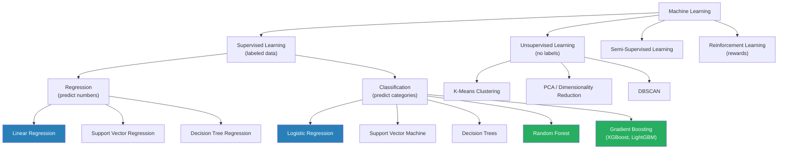
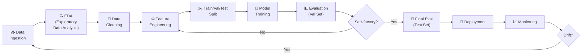

# Phase 2: Machine Learning
**Months 4–6 | Difficulty: 6/10 | Label: 🔴 Must Learn**

> **Previous Phase**: [Phase 1 — Mathematics for ML](./02_Phase1_Mathematics_for_ML.md)  
> **Next Phase**: [Phase 3a — Deep Learning Theory](./04_Phase3_Part1_Deep_Learning_Theory.md)

---

## Table of Contents

- [Phase Overview](#phase-overview)
- [Why Machine Learning?](#why-machine-learning)
- [The Big Picture: ML Taxonomy](#the-big-picture-ml-taxonomy)
- [Topic 1: Core Supervised Learning](#topic-1-core-supervised-learning)
  - [Linear Regression](#linear-regression)
  - [Logistic Regression](#logistic-regression)
  - [Decision Trees](#decision-trees)
  - [Random Forests](#random-forests)
  - [Gradient Boosting & XGBoost](#gradient-boosting--xgboost)
- [Topic 2: Unsupervised Learning](#topic-2-unsupervised-learning)
  - [K-Means Clustering](#k-means-clustering)
  - [PCA (Applied)](#pca-applied)
- [Topic 3: The ML Engineering Mindset](#topic-3-the-ml-engineering-mindset)
  - [The Bias-Variance Tradeoff](#the-bias-variance-tradeoff)
  - [Regularization](#regularization)
  - [Evaluation Metrics](#evaluation-metrics)
  - [Cross-Validation](#cross-validation)
  - [Feature Engineering](#feature-engineering)
  - [Hyperparameter Tuning](#hyperparameter-tuning)
- [Topic 4: The Full ML Pipeline](#topic-4-the-full-ml-pipeline)
- [Resources](#resources)
- [Phase 2 Projects](#phase-2-projects)
- [Common Mistakes](#common-mistakes)
- [Week-by-Week Plan](#week-by-week-plan)
- [Interview Importance](#interview-importance)
- [Mastery Checklist](#mastery-checklist)

---

## Phase Overview

| Attribute | Details |
|-----------|---------|
| **Duration** | Months 4–6 (8 weeks) |
| **Daily Time** | 1–2 hours |
| **Difficulty** | 6/10 |
| **Label** | 🔴 Must Learn |
| **Prerequisites** | Phase 1 complete (gradients, probability, loss functions) |
| **Outcome** | Can build, evaluate, and tune ML models; understands generalization deeply |

---

## Why Machine Learning?

You might wonder: *"Why spend 2 months on classical ML when I want to do GenAI?"*

Here is the honest answer. Classical ML teaches you the **core problem of AI**: how do you build a system that generalizes from examples it has seen to examples it hasn't? This problem never goes away in GenAI:

- **Overfitting** in LLMs: why fine-tuning on small datasets degrades performance
- **Generalization**: why a language model trained on web text can answer medical questions  
- **Evaluation rigor**: how to measure if your RAG system actually improved
- **Bias-variance tradeoff**: why bigger models don't always help
- **Feature engineering intuition**: still relevant for structured data + LLM systems

Additionally, **production AI systems today** often combine classical ML with LLMs — using XGBoost for tabular data and LLMs for text, both feeding into the same pipeline. You need to be fluent in both.

---

## The Big Picture: ML Taxonomy



**Focus for this phase** (by production importance):
1. Logistic Regression — understand deeply, it's the building block
2. Gradient Boosting (XGBoost) — most important classical ML algorithm for production
3. Random Forests — ensemble thinking, important concept
4. Decision Trees — foundation for ensembles
5. Linear Regression — derive from scratch; connects to neural networks

---

## Topic 1: Core Supervised Learning

### Linear Regression

**Why**: The simplest model that connects math to ML. Derive the gradient descent update and you've understood training in its purest form.

**Algorithm**: Find weights $W$ and bias $b$ such that $\hat{y} = XW + b$ minimizes MSE loss.

$$\mathcal{L}(W, b) = \frac{1}{N}\sum_{i=1}^N (y_i - \hat{y}_i)^2$$

```python
import numpy as np
import matplotlib.pyplot as plt

class LinearRegression:
    """
    Linear Regression implemented from scratch with gradient descent.
    This is the conceptual foundation of every neural network.
    """
    def __init__(self, learning_rate=0.01, n_iterations=1000):
        self.lr = learning_rate
        self.n_iter = n_iterations
        self.weights = None
        self.bias = None
        self.loss_history = []
    
    def fit(self, X: np.ndarray, y: np.ndarray):
        n_samples, n_features = X.shape
        self.weights = np.zeros(n_features)
        self.bias = 0.0
        
        for i in range(self.n_iter):
            # Forward pass
            y_pred = X @ self.weights + self.bias
            
            # Compute MSE loss
            loss = np.mean((y_pred - y) ** 2)
            self.loss_history.append(loss)
            
            # Backward pass — compute gradients
            # dL/dW = (2/N) * X^T @ (y_pred - y)
            # dL/db = (2/N) * sum(y_pred - y)
            residuals = y_pred - y
            dW = (2 / n_samples) * X.T @ residuals
            db = (2 / n_samples) * np.sum(residuals)
            
            # Gradient descent update
            self.weights -= self.lr * dW
            self.bias -= self.lr * db
        
        return self
    
    def predict(self, X: np.ndarray) -> np.ndarray:
        return X @ self.weights + self.bias
    
    def score(self, X: np.ndarray, y: np.ndarray) -> float:
        """R² score"""
        y_pred = self.predict(X)
        ss_res = np.sum((y - y_pred) ** 2)
        ss_tot = np.sum((y - np.mean(y)) ** 2)
        return 1 - ss_res / ss_tot

# Test it
from sklearn.datasets import make_regression
from sklearn.model_selection import train_test_split
from sklearn.preprocessing import StandardScaler

X, y = make_regression(n_samples=1000, n_features=10, noise=20, random_state=42)
X_train, X_test, y_train, y_test = train_test_split(X, y, test_size=0.2)

# Always scale features for gradient descent-based methods
scaler = StandardScaler()
X_train = scaler.fit_transform(X_train)
X_test = scaler.transform(X_test)

model = LinearRegression(learning_rate=0.1, n_iterations=500)
model.fit(X_train, y_train)

print(f"R² score: {model.score(X_test, y_test):.4f}")
print(f"Final loss: {model.loss_history[-1]:.4f}")

# Plot convergence
plt.plot(model.loss_history)
plt.xlabel('Iteration'); plt.ylabel('MSE Loss')
plt.title('Training Convergence'); plt.show()
```

**Normal equation** (analytical solution — no gradient descent needed for linear regression):

$$W^* = (X^TX)^{-1}X^Ty$$

```python
# Compare gradient descent with analytical solution
W_analytical = np.linalg.inv(X_train.T @ X_train) @ X_train.T @ y_train
y_pred_analytical = X_test @ W_analytical
ss_res = np.sum((y_test - y_pred_analytical) ** 2)
ss_tot = np.sum((y_test - np.mean(y_test)) ** 2)
print(f"Analytical R²: {1 - ss_res/ss_tot:.4f}")
# Should match gradient descent (within numerical tolerance)
```

---

### Logistic Regression

**Why**: Logistic regression is the simplest classification model and directly connects to neural network output layers. Binary cross-entropy loss + sigmoid activation = logistic regression.

The sigmoid function maps any real number to [0, 1]:

$$\sigma(z) = \frac{1}{1 + e^{-z}}$$

For binary classification:

$$P(y=1 \mid x) = \sigma(W^Tx + b)$$

Loss (binary cross-entropy, derived from MLE):

$$\mathcal{L} = -\frac{1}{N}\sum_{i=1}^N \left[y_i \log \hat{p}_i + (1-y_i)\log(1-\hat{p}_i)\right]$$

```python
import numpy as np

class LogisticRegression:
    """
    Logistic Regression from scratch.
    Note the beautiful simplification: gradient = (y_pred - y_true) * X
    This same structure appears in the output layer of every neural network.
    """
    def __init__(self, learning_rate=0.01, n_iterations=1000):
        self.lr = learning_rate
        self.n_iter = n_iterations
        self.weights = None
        self.bias = None
    
    def sigmoid(self, z: np.ndarray) -> np.ndarray:
        # Numerically stable sigmoid
        return np.where(z >= 0,
                       1 / (1 + np.exp(-z)),
                       np.exp(z) / (1 + np.exp(z)))
    
    def binary_cross_entropy(self, y_pred: np.ndarray, y_true: np.ndarray) -> float:
        eps = 1e-10
        return -np.mean(y_true * np.log(y_pred + eps) + 
                       (1 - y_true) * np.log(1 - y_pred + eps))
    
    def fit(self, X: np.ndarray, y: np.ndarray):
        n_samples, n_features = X.shape
        self.weights = np.zeros(n_features)
        self.bias = 0.0
        
        for _ in range(self.n_iter):
            # Forward pass
            z = X @ self.weights + self.bias
            y_pred = self.sigmoid(z)
            
            # Beautiful gradient: dL/dW = (1/N) * X^T @ (y_pred - y)
            # (This is because BCE loss gradient through sigmoid simplifies to y_pred - y)
            error = y_pred - y
            dW = (1 / n_samples) * X.T @ error
            db = (1 / n_samples) * np.sum(error)
            
            self.weights -= self.lr * dW
            self.bias -= self.lr * db
        
        return self
    
    def predict_proba(self, X: np.ndarray) -> np.ndarray:
        return self.sigmoid(X @ self.weights + self.bias)
    
    def predict(self, X: np.ndarray, threshold: float = 0.5) -> np.ndarray:
        return (self.predict_proba(X) >= threshold).astype(int)
```

---

### Decision Trees

**Why**: Decision trees are the foundation of random forests and gradient boosting — the most powerful classical ML algorithms. Understanding splits and information gain unlocks ensemble thinking.

```python
# Concept: Information Gain for splitting
def entropy(y: np.ndarray) -> float:
    """Measure of impurity in a node."""
    classes, counts = np.unique(y, return_counts=True)
    probabilities = counts / len(y)
    return -np.sum(probabilities * np.log2(probabilities + 1e-10))

def information_gain(y_parent: np.ndarray, 
                     y_left: np.ndarray, 
                     y_right: np.ndarray) -> float:
    """
    Information gain from a split.
    A good split creates child nodes that are more pure (lower entropy).
    """
    n = len(y_parent)
    n_left, n_right = len(y_left), len(y_right)
    
    # Weighted entropy of children
    child_entropy = (n_left / n) * entropy(y_left) + (n_right / n) * entropy(y_right)
    
    # Gain = reduction in entropy
    return entropy(y_parent) - child_entropy

# Example: which feature splits this data better?
y = np.array([0, 0, 1, 1, 1, 0, 1, 0])  # Mixed classes

# Split 1: creates [0,0,0] and [1,1,1,1,0]  
y_left1 = np.array([0, 0, 0])
y_right1 = np.array([1, 1, 1, 1, 0])
ig1 = information_gain(y, y_left1, y_right1)

# Split 2: creates [0,0,1,1] and [1,0,1,0]  — worse split
y_left2 = np.array([0, 0, 1, 1])
y_right2 = np.array([1, 0, 1, 0])
ig2 = information_gain(y, y_left2, y_right2)

print(f"Split 1 information gain: {ig1:.4f}")
print(f"Split 2 information gain: {ig2:.4f}")
print(f"Split 1 is {'better' if ig1 > ig2 else 'worse'}")
```

**Key concepts**:
- **Gini impurity** (alternative to entropy): $G = 1 - \sum_k p_k^2$ — slightly faster to compute
- **Max depth**: limits tree size to prevent overfitting
- **Min samples per leaf**: another regularization mechanism
- **Pruning**: removing branches that don't improve test performance

---

### Random Forests

**Why**: Random forests introduce the key concept of **ensemble learning** — combining many weak models produces a strong model. This is a fundamental idea in AI: averaging over uncertainty reduces variance.

**Algorithm**:
1. For each of N trees:
   - Sample rows with replacement (**bootstrap** sampling)
   - At each split, consider only a random subset of features
   - Grow a deep (low-bias) tree
2. Predict by voting (classification) or averaging (regression)

```python
from sklearn.ensemble import RandomForestClassifier
from sklearn.datasets import make_classification
from sklearn.model_selection import cross_val_score
import numpy as np

# Create imbalanced dataset (common in real-world AI)
X, y = make_classification(n_samples=2000, n_features=20, 
                            n_informative=10, weights=[0.8, 0.2],
                            random_state=42)

# Compare single tree vs. random forest
from sklearn.tree import DecisionTreeClassifier
from sklearn.model_selection import StratifiedKFold

cv = StratifiedKFold(n_splits=5, shuffle=True, random_state=42)

tree = DecisionTreeClassifier(max_depth=10, random_state=42)
rf = RandomForestClassifier(n_estimators=100, max_depth=10, random_state=42)

tree_scores = cross_val_score(tree, X, y, cv=cv, scoring='roc_auc')
rf_scores = cross_val_score(rf, X, y, cv=cv, scoring='roc_auc')

print(f"Decision Tree ROC-AUC: {tree_scores.mean():.4f} ± {tree_scores.std():.4f}")
print(f"Random Forest ROC-AUC: {rf_scores.mean():.4f} ± {rf_scores.std():.4f}")

# Feature importance — Random Forests give you this for free
rf.fit(X, y)
importances = rf.feature_importances_
print("\nTop 5 features by importance:")
for idx in np.argsort(importances)[::-1][:5]:
    print(f"  Feature {idx}: {importances[idx]:.4f}")
```

**Why random forests reduce variance**: Each tree sees different data (bootstrap) and different features (random subsets). Errors of individual trees are uncorrelated. When you average uncorrelated errors, they cancel out — variance decreases without increasing bias.

---

### Gradient Boosting & XGBoost

**Why**: XGBoost wins Kaggle competitions. It is the most powerful classical ML algorithm for tabular data. Understanding boosting teaches you about additive models and residual learning — concepts that appear in diffusion models and beyond.

**Key insight**: Each new tree learns from the **residuals** (errors) of all previous trees. You're sequentially building a better and better approximation.

```python
import numpy as np

# Conceptual implementation of gradient boosting
class SimpleGradientBoosting:
    """
    Simplified gradient boosting from scratch.
    Real XGBoost uses second-order gradients and regularization,
    but this captures the core idea.
    """
    def __init__(self, n_estimators=100, learning_rate=0.1, max_depth=3):
        self.n_estimators = n_estimators
        self.lr = learning_rate
        self.max_depth = max_depth
        self.trees = []
        self.initial_prediction = None
    
    def fit(self, X: np.ndarray, y: np.ndarray):
        from sklearn.tree import DecisionTreeRegressor
        
        # Start with the mean prediction
        self.initial_prediction = np.mean(y)
        y_pred = np.full(len(y), self.initial_prediction)
        
        for _ in range(self.n_estimators):
            # Compute residuals (negative gradient of MSE)
            residuals = y - y_pred
            
            # Fit a tree to the residuals
            tree = DecisionTreeRegressor(max_depth=self.max_depth)
            tree.fit(X, residuals)
            self.trees.append(tree)
            
            # Update predictions: move a small step in the right direction
            y_pred += self.lr * tree.predict(X)
        
        return self
    
    def predict(self, X: np.ndarray) -> np.ndarray:
        y_pred = np.full(X.shape[0], self.initial_prediction)
        for tree in self.trees:
            y_pred += self.lr * tree.predict(X)
        return y_pred

# Use real XGBoost in practice
import xgboost as xgb
from sklearn.datasets import make_classification
from sklearn.model_selection import train_test_split
from sklearn.metrics import classification_report, roc_auc_score

X, y = make_classification(n_samples=5000, n_features=20, random_state=42)
X_train, X_test, y_train, y_test = train_test_split(X, y, test_size=0.2, random_state=42)

# XGBoost — the most important classical ML library
model = xgb.XGBClassifier(
    n_estimators=100,
    max_depth=6,
    learning_rate=0.1,
    subsample=0.8,          # row subsampling (like random forest)
    colsample_bytree=0.8,   # column subsampling
    reg_alpha=0.1,          # L1 regularization
    reg_lambda=1.0,         # L2 regularization
    eval_metric='logloss',
    random_state=42,
    verbosity=0
)

model.fit(X_train, y_train,
          eval_set=[(X_test, y_test)],
          verbose=False)

y_pred = model.predict(X_test)
y_pred_proba = model.predict_proba(X_test)[:, 1]

print(classification_report(y_test, y_pred))
print(f"ROC-AUC: {roc_auc_score(y_test, y_pred_proba):.4f}")
```

**SHAP values for explainability** (critical for production AI):

```python
import shap

# Explain predictions using SHAP
explainer = shap.TreeExplainer(model)
shap_values = explainer.shap_values(X_test[:100])

# Summary plot — which features matter most and how
shap.summary_plot(shap_values, X_test[:100], show=False)

# Force plot — explain a single prediction
shap.force_plot(explainer.expected_value, shap_values[0], X_test[0])
```

---

## Topic 2: Unsupervised Learning

### K-Means Clustering

**Algorithm**:
1. Initialize k centroids randomly
2. Assign each point to the nearest centroid
3. Update centroids to mean of assigned points
4. Repeat until convergence

```python
import numpy as np

class KMeans:
    def __init__(self, n_clusters: int, max_iter: int = 300, random_state: int = 42):
        self.k = n_clusters
        self.max_iter = max_iter
        self.rng = np.random.default_rng(random_state)
        self.centroids = None
    
    def fit(self, X: np.ndarray):
        # Initialize centroids with k-means++ (smarter than random)
        idx = self.rng.integers(0, len(X))
        centroids = [X[idx]]
        
        for _ in range(self.k - 1):
            # Choose next centroid with probability proportional to distance
            dists = np.min([np.sum((X - c)**2, axis=1) for c in centroids], axis=0)
            probs = dists / dists.sum()
            idx = self.rng.choice(len(X), p=probs)
            centroids.append(X[idx])
        
        self.centroids = np.array(centroids)
        
        for _ in range(self.max_iter):
            # Assign step: vectorized distance computation
            # Shape: (n_samples, k) via broadcasting
            distances = np.linalg.norm(X[:, np.newaxis] - self.centroids, axis=2)
            labels = np.argmin(distances, axis=1)
            
            # Update step
            new_centroids = np.array([X[labels == k].mean(axis=0) for k in range(self.k)])
            
            if np.allclose(self.centroids, new_centroids):
                break
            self.centroids = new_centroids
        
        self.labels_ = labels
        return self
```

**In AI**: K-Means is used to cluster embeddings, analyze document topics, and find natural groupings in your data before building AI systems.

---

### PCA (Applied)

You implemented PCA in Phase 1 mathematically. Now apply it to real AI problems:

```python
import numpy as np
import matplotlib.pyplot as plt
from sklearn.decomposition import PCA
from sklearn.datasets import load_digits

# Visualize high-dimensional embeddings in 2D using PCA
# This is the exact same technique used to visualize word embeddings

digits = load_digits()
X = digits.data          # 1797 samples, 64 features (8x8 images)
y = digits.target

pca = PCA(n_components=2)
X_2d = pca.fit_transform(X)

print(f"Original shape: {X.shape}")
print(f"Reduced shape: {X_2d.shape}")
print(f"Explained variance: {pca.explained_variance_ratio_.sum():.1%}")

plt.figure(figsize=(10, 8))
scatter = plt.scatter(X_2d[:, 0], X_2d[:, 1], c=y, cmap='tab10', alpha=0.7)
plt.colorbar(scatter, label='Digit')
plt.title('Digit embeddings in 2D (via PCA)\nEach color = one digit class')
plt.show()

# This visualization technique is used for:
# - Understanding what features a model has learned
# - Debugging embedding quality in RAG systems
# - Analyzing clusters in your data
```

---

## Topic 3: The ML Engineering Mindset

### The Bias-Variance Tradeoff

This is the **most important conceptual framework** in all of machine learning.

| | High Variance | Low Variance |
|--|--|--|
| **High Bias** | — (bad both ways) | Underfitting (too simple) |
| **Low Bias** | Overfitting (too complex) | Good generalization ✓ |

```
Error = Bias² + Variance + Irreducible Noise

Bias:      How wrong is the model on average? (underfitting)
Variance:  How much does model change with different training data? (overfitting)
```

```python
import numpy as np
import matplotlib.pyplot as plt
from sklearn.pipeline import Pipeline
from sklearn.preprocessing import PolynomialFeatures
from sklearn.linear_model import LinearRegression
from sklearn.model_selection import learning_curve

# Visualize bias-variance with polynomial regression
np.random.seed(42)
X_true = np.linspace(0, 1, 100)
y_true = np.sin(2 * np.pi * X_true)

# Training data with noise
X_train = np.sort(np.random.choice(X_true, 20))
y_train = np.sin(2 * np.pi * X_train) + np.random.randn(20) * 0.2

fig, axes = plt.subplots(1, 3, figsize=(15, 5))
degrees = [1, 4, 15]
labels = ['Underfitting\n(High Bias)', 'Good Fit', 'Overfitting\n(High Variance)']

for ax, degree, label in zip(axes, degrees, labels):
    model = Pipeline([
        ('poly', PolynomialFeatures(degree=degree)),
        ('linear', LinearRegression())
    ])
    model.fit(X_train.reshape(-1, 1), y_train)
    
    X_plot = np.linspace(0, 1, 200).reshape(-1, 1)
    y_plot = model.predict(X_plot)
    
    ax.scatter(X_train, y_train, color='red', s=50, label='Training data')
    ax.plot(X_true, y_true, 'b-', label='True function')
    ax.plot(X_plot, y_plot, 'g-', label=f'Degree {degree}')
    ax.set_title(label); ax.legend(); ax.set_ylim(-2, 2)

plt.tight_layout(); plt.show()
```

---

### Regularization

Regularization adds a penalty to the loss function to discourage complex models:

| Method | Formula | Effect | Use Case |
|--------|---------|--------|----------|
| L2 (Ridge) | $\mathcal{L} + \lambda\sum w_i^2$ | Shrinks weights evenly | Correlated features |
| L1 (Lasso) | $\mathcal{L} + \lambda\sum \|w_i\|$ | Creates sparsity (zeros) | Feature selection |
| Elastic Net | L1 + L2 combined | Both effects | General purpose |
| Dropout | Random zero-out during training | Ensemble effect | Neural networks |
| Early Stopping | Stop when val loss increases | Prevents over-training | All models |

**Why L1 creates sparsity and L2 doesn't** (geometric intuition):

```
L2 penalty (circle) + loss function = minimum at non-zero intersection
L1 penalty (diamond) + loss function = minimum often at corner (zero weight)
```

```python
import numpy as np
from sklearn.linear_model import Ridge, Lasso, ElasticNet
from sklearn.datasets import make_regression

X, y, true_coef = make_regression(n_samples=100, n_features=20, 
                                   n_informative=5, noise=10,
                                   coef=True, random_state=42)

# Compare: which coefficients does each method zero out?
models = {
    'No regularization': LinearRegression(),
    'L2 (Ridge, α=1.0)': Ridge(alpha=1.0),
    'L1 (Lasso, α=0.1)': Lasso(alpha=0.1, max_iter=5000),
}

print(f"{'Method':<25} {'Non-zero coefs':>15} {'Train R²':>10} {'Sparsity':>10}")
print("-" * 65)
for name, model in models.items():
    model.fit(X, y)
    coef = model.coef_
    n_nonzero = np.sum(np.abs(coef) > 1e-6)
    r2 = model.score(X, y)
    sparsity = 1 - n_nonzero / len(coef)
    print(f"{name:<25} {n_nonzero:>15} {r2:>10.4f} {sparsity:>10.1%}")
```

---

### Evaluation Metrics

**This is where most engineers make mistakes.** Choosing the wrong metric can make a terrible model look good.

```python
import numpy as np
from sklearn.metrics import (confusion_matrix, classification_report,
                              roc_auc_score, average_precision_score,
                              precision_recall_curve, roc_curve)

# Example: Fraud detection — 99% of transactions are legitimate
# A model that predicts "not fraud" always has 99% accuracy but is USELESS

y_true = np.array([0]*990 + [1]*10)  # 1% fraud rate
y_pred_bad = np.zeros(1000, dtype=int)  # Always predicts "not fraud"
y_pred_good = np.concatenate([np.zeros(990), np.ones(10)])

print("Bad model (always predicts 0):")
print(f"  Accuracy: {(y_pred_bad == y_true).mean():.1%}")
print(f"  Precision: 0.0 (can't predict fraud)")
print(f"  Recall: 0.0 (misses all fraud)")
print()

# Metric selection guide:
print("=" * 60)
print("METRIC SELECTION GUIDE")
print("=" * 60)
metric_guide = {
    "Balanced classes, equal importance": "Accuracy, F1",
    "Imbalanced classes": "ROC-AUC, Precision-Recall AUC",
    "Cost of False Positive > False Negative": "Precision",
    "Cost of False Negative > False Positive": "Recall",
    "Multi-class, imbalanced": "Macro F1, Weighted F1",
    "LLM generation quality": "BLEU (weak), ROUGE, Human eval",
    "RAG system quality": "Faithfulness, Answer Relevance (RAGAS)",
    "Embedding quality": "MTEB benchmark, Recall@K"
}
for scenario, metric in metric_guide.items():
    print(f"  {scenario}:")
    print(f"    → Use: {metric}")
```

#### The Full Evaluation Framework

```python
def evaluate_classifier(y_true, y_pred, y_pred_proba=None, dataset_name="Test"):
    """
    Complete evaluation suite — use this for every classifier you build.
    """
    from sklearn.metrics import (
        accuracy_score, precision_score, recall_score, f1_score,
        roc_auc_score, confusion_matrix
    )
    
    print(f"\n{'='*50}")
    print(f"Evaluation: {dataset_name}")
    print(f"{'='*50}")
    
    # Basic metrics
    print(f"Accuracy:  {accuracy_score(y_true, y_pred):.4f}")
    print(f"Precision: {precision_score(y_true, y_pred, average='weighted'):.4f}")
    print(f"Recall:    {recall_score(y_true, y_pred, average='weighted'):.4f}")
    print(f"F1 Score:  {f1_score(y_true, y_pred, average='weighted'):.4f}")
    
    if y_pred_proba is not None:
        print(f"ROC-AUC:   {roc_auc_score(y_true, y_pred_proba):.4f}")
    
    # Confusion matrix
    cm = confusion_matrix(y_true, y_pred)
    print(f"\nConfusion Matrix:\n{cm}")
    
    # Class distribution
    print(f"\nPredicted distribution: {dict(zip(*np.unique(y_pred, return_counts=True)))}")
    print(f"True distribution:      {dict(zip(*np.unique(y_true, return_counts=True)))}")
```

---

### Cross-Validation

Never evaluate on training data. Never use test data for model selection.

```
Data Split:
├── Training Set (60–70%)   — used to fit model
├── Validation Set (15–20%) — used to tune hyperparameters
└── Test Set (15–20%)       — touched ONCE at the end for final evaluation

K-Fold Cross-Validation:
Split training data into K folds
For each fold:
    Train on K-1 folds
    Evaluate on held-out fold
Average performance across K folds
```

```python
from sklearn.model_selection import StratifiedKFold, cross_validate
from sklearn.pipeline import Pipeline
from sklearn.preprocessing import StandardScaler
import numpy as np

def full_cv_evaluation(X, y, model, n_splits=5):
    """
    Proper cross-validation with multiple metrics.
    Always use this pattern for model evaluation.
    """
    cv = StratifiedKFold(n_splits=n_splits, shuffle=True, random_state=42)
    
    # Wrap in pipeline with scaling — prevents data leakage
    pipeline = Pipeline([
        ('scaler', StandardScaler()),
        ('model', model)
    ])
    
    scores = cross_validate(
        pipeline, X, y, cv=cv,
        scoring=['accuracy', 'f1_weighted', 'roc_auc'],
        return_train_score=True  # check for overfitting
    )
    
    for metric in ['accuracy', 'f1_weighted', 'roc_auc']:
        train_mean = scores[f'train_{metric}'].mean()
        test_mean = scores[f'test_{metric}'].mean()
        test_std = scores[f'test_{metric}'].std()
        gap = train_mean - test_mean
        overfit = "⚠️ OVERFIT" if gap > 0.05 else "✓ OK"
        print(f"{metric:15} Train: {train_mean:.4f} | Val: {test_mean:.4f} ± {test_std:.4f} | Gap: {gap:.4f} {overfit}")
```

---

### Feature Engineering

Feature engineering is the art of creating informative inputs for ML models. Even with LLMs, structured data still benefits enormously from good features.

```python
import pandas as pd
import numpy as np

# Example: Engineering features for a churn prediction model
# This type of feature engineering feeds directly into
# fine-tuning datasets and RAG metadata

def engineer_features(df: pd.DataFrame) -> pd.DataFrame:
    """Feature engineering example for customer churn."""
    df = df.copy()
    
    # Date/time features
    df['days_since_last_login'] = (pd.Timestamp.now() - df['last_login']).dt.days
    df['account_age_months'] = (pd.Timestamp.now() - df['created_at']).dt.days / 30
    
    # Ratio features (capture relative behavior)
    df['pages_per_session'] = df['total_pages'] / (df['total_sessions'] + 1)
    df['revenue_per_day'] = df['total_revenue'] / (df['account_age_months'] * 30 + 1)
    
    # Aggregation over time windows
    df['pct_active_days_last_30'] = df['active_days_last_30'] / 30
    
    # Binning continuous variables
    df['age_group'] = pd.qcut(df['age'], q=4, labels=['Q1', 'Q2', 'Q3', 'Q4'])
    
    # Interaction features
    df['high_value_at_risk'] = (
        (df['total_revenue'] > df['total_revenue'].quantile(0.8)) & 
        (df['days_since_last_login'] > 30)
    ).astype(int)
    
    return df
```

---

### Hyperparameter Tuning

```python
from sklearn.model_selection import RandomizedSearchCV
from scipy.stats import randint, uniform
import xgboost as xgb

# Use RandomizedSearch over GridSearch — much more efficient
param_distributions = {
    'n_estimators': randint(50, 500),
    'max_depth': randint(3, 10),
    'learning_rate': uniform(0.01, 0.3),
    'subsample': uniform(0.6, 0.4),
    'colsample_bytree': uniform(0.6, 0.4),
    'reg_alpha': uniform(0, 1),
    'reg_lambda': uniform(0, 2),
}

model = xgb.XGBClassifier(random_state=42, verbosity=0)
search = RandomizedSearchCV(
    model, param_distributions,
    n_iter=50,          # evaluate 50 random combinations
    cv=5,
    scoring='roc_auc',
    n_jobs=-1,          # use all CPU cores
    random_state=42,
    verbose=1
)

search.fit(X_train, y_train)
print(f"Best ROC-AUC: {search.best_score_:.4f}")
print(f"Best params: {search.best_params_}")
```

---

## Topic 4: The Full ML Pipeline

A production ML pipeline has these stages. Master this flow:



```python
# Complete ML pipeline with proper data hygiene
from sklearn.pipeline import Pipeline
from sklearn.preprocessing import StandardScaler, OneHotEncoder
from sklearn.compose import ColumnTransformer
from sklearn.impute import SimpleImputer
from sklearn.model_selection import train_test_split
from sklearn.metrics import roc_auc_score
import xgboost as xgb
import pandas as pd
import numpy as np

def build_production_ml_pipeline(df: pd.DataFrame, target_col: str):
    """
    Production-grade ML pipeline.
    Handles: missing values, categorical encoding, scaling, training.
    """
    X = df.drop(columns=[target_col])
    y = df[target_col]
    
    # Identify column types
    numeric_cols = X.select_dtypes(include=[np.number]).columns.tolist()
    categorical_cols = X.select_dtypes(include=['object', 'category']).columns.tolist()
    
    # Preprocessing: different strategies for different column types
    numeric_transformer = Pipeline([
        ('imputer', SimpleImputer(strategy='median')),  # fill missing with median
        ('scaler', StandardScaler())
    ])
    
    categorical_transformer = Pipeline([
        ('imputer', SimpleImputer(strategy='constant', fill_value='Unknown')),
        ('encoder', OneHotEncoder(handle_unknown='ignore', sparse_output=False))
    ])
    
    preprocessor = ColumnTransformer([
        ('num', numeric_transformer, numeric_cols),
        ('cat', categorical_transformer, categorical_cols)
    ])
    
    # Full pipeline: preprocessing + model
    pipeline = Pipeline([
        ('preprocessor', preprocessor),
        ('model', xgb.XGBClassifier(n_estimators=100, random_state=42, verbosity=0))
    ])
    
    # Proper split — stratified for imbalanced classes
    X_train, X_test, y_train, y_test = train_test_split(
        X, y, test_size=0.2, stratify=y, random_state=42
    )
    
    pipeline.fit(X_train, y_train)
    
    y_pred_proba = pipeline.predict_proba(X_test)[:, 1]
    score = roc_auc_score(y_test, y_pred_proba)
    print(f"Test ROC-AUC: {score:.4f}")
    
    return pipeline
```

---

## Resources

| Rank | Resource | Type | Cost | Why |
|------|----------|------|------|-----|
| 1 | [Stanford CS229 (Andrew Ng)](https://www.youtube.com/playlist?list=PLoROMvodv4rMiGQp3WXShtMGgzqpfVfbU) | YouTube | Free | Gold standard for ML theory. Rigorous mathematical treatment. Most important resource for Phase 2. |
| 2 | [Machine Learning Specialization (DeepLearning.AI)](https://www.coursera.org/specializations/machine-learning-introduction) | Course | ~$50/mo | Best structured course with hands-on labs. Andrew Ng teaches this too. |
| 3 | Hands-On Machine Learning with Scikit-Learn, Keras & TensorFlow, 3rd ed. (Géron) | Book | ~$60 | The best practical ML book. Read Part 1 (Ch 1–8) for this phase. |
| 4 | [StatQuest YouTube](https://www.youtube.com/@statquest) | YouTube | Free | Josh Starmer makes every algorithm visual and intuitive. Indispensable. |
| 5 | [Kaggle Learn](https://www.kaggle.com/learn) | Course | Free | Hands-on, practical. Good for XGBoost and feature engineering. |

**Best book**: Hands-On ML by Géron. Buy it. Read chapters 1–8 cover to cover.  
**Best YouTube**: StatQuest for conceptual clarity + CS229 for mathematical depth.

---

## Phase 2 Projects

### Project 1: Spam Email Classifier (From Scratch)
**Difficulty**: 3/10 | **Time**: 1 week

Build without sklearn:
- TF-IDF features using NumPy
- Logistic regression with gradient descent
- Evaluation: precision, recall, F1, confusion matrix
- Compare with sklearn's `LogisticRegression`

**Extension**: Add Naive Bayes and compare probabilistically.

---

### Project 2: Customer Churn Prediction
**Difficulty**: 4/10 | **Time**: 2 weeks

End-to-end pipeline:
1. EDA with Pandas + matplotlib
2. Feature engineering (20+ engineered features)
3. XGBoost with hyperparameter tuning
4. SHAP explainability
5. Business impact: "Our model would save $X per year if deployed"

**Dataset**: Telco Customer Churn on Kaggle

**Extension**: Add a calibration curve and isotonic regression to calibrate probabilities.

---

### Project 3: Tabular Data + LLM Feature Enrichment
**Difficulty**: 5/10 | **Time**: 1 week

This bridges classical ML and GenAI:
1. Train XGBoost on structured data
2. Use an LLM to extract features from unstructured text in the same dataset
3. Combine structured + LLM features into final XGBoost model
4. Compare performance

**Dataset**: Amazon product reviews — predict star rating from text + metadata

**Skills**: Proves you can combine classical ML with LLMs — a very practical production skill.

---

## Common Mistakes

| Mistake | Why It Happens | Fix |
|---------|---------------|-----|
| Skipping classical ML for deep learning | Impatience | Classical ML teaches generalization; can't debug DL without this |
| Using accuracy for imbalanced datasets | Default metric trap | Always check class balance first; use ROC-AUC for imbalanced |
| Data leakage in preprocessing | Not thinking about train/test | Put ALL preprocessing inside sklearn Pipeline |
| Not using cross-validation | "Test set is enough" | 5-fold CV gives honest performance estimates |
| Ignoring SHAP / explainability | "Model works, that's enough" | Explainability is required in production AI |
| Fitting on test set (even accidentally) | Peeking at test data | Treat test set as sacred; touch only once |
| Over-engineering features | Too much time on features | Start simple, add complexity if model underfits |

---

## Week-by-Week Plan

| Week | Topic | Resource | Output |
|------|-------|----------|--------|
| **Week 1** | Linear/Logistic regression from scratch | CS229 Lectures 1–3 + Géron Ch 4 | Both algorithms implemented in NumPy |
| **Week 2** | Decision Trees + Random Forests | CS229 Lectures 9–10 + StatQuest RF videos | Understand info gain; RF experiment |
| **Week 3** | XGBoost + gradient boosting | StatQuest XGBoost series + Kaggle Learn | XGBoost on churn dataset |
| **Week 4** | Evaluation metrics + cross-validation | Géron Ch 3 + DeepLearning.AI course | `evaluate_classifier` function |
| **Week 5** | Feature engineering + pipelines | Géron Ch 2 + Kaggle feature engineering | Full sklearn Pipeline |
| **Week 6** | Project 1: Spam Classifier | Self-directed | GitHub: spam classifier from scratch |
| **Week 7** | Project 2: Customer Churn | Self-directed | GitHub: churn with SHAP |
| **Week 8** | Project 3: Tabular + LLM features | Self-directed | GitHub: hybrid XGBoost + LLM |

---

## Interview Importance

| Topic | Frequency | Common Question |
|-------|:--:|---------|
| Bias-variance tradeoff | 🔴 Very High | "Explain overfitting and underfitting. How do you fix each?" |
| Evaluation metrics selection | 🔴 Very High | "Which metric would you use for fraud detection and why?" |
| Random Forest vs. XGBoost | 🟡 Medium | "When would you use one over the other?" |
| Feature engineering | 🔴 High | "Walk me through your feature engineering process" |
| Cross-validation | 🟡 Medium | "What's the difference between K-Fold and Stratified K-Fold?" |
| Regularization | 🟡 Medium | "Why does L1 create sparsity and L2 doesn't?" |
| Data leakage | 🔴 High | "What is data leakage? Give an example." |

---

## Mastery Checklist

### Algorithms
- [ ] Implemented linear regression with gradient descent from scratch
- [ ] Implemented logistic regression with binary cross-entropy from scratch
- [ ] Can explain information gain and how decision trees use it
- [ ] Understands why random forests reduce variance (mathematical intuition)
- [ ] Understands gradient boosting as additive residual learning
- [ ] Can tune XGBoost with RandomizedSearchCV

### Engineering
- [ ] Builds complete sklearn Pipelines with preprocessing inside
- [ ] Never fits on test set; uses train/val/test correctly
- [ ] Uses stratified K-fold cross-validation by default
- [ ] Uses SHAP for feature importance and explainability
- [ ] Selects metrics based on problem type (not just accuracy)

### Projects
- [ ] Spam classifier from scratch (no sklearn for the model itself)
- [ ] Customer churn with XGBoost + SHAP + cross-validation
- [ ] Tabular + LLM hybrid project

---

## Moving to Phase 3

**Before proceeding to [Phase 3a: Deep Learning Theory](./04_Phase3_Part1_Deep_Learning_Theory.md), confirm:**

- [ ] Implemented linear and logistic regression from scratch
- [ ] Built a complete XGBoost pipeline with cross-validation and SHAP
- [ ] Understands bias-variance tradeoff deeply enough to explain it with a diagram
- [ ] Completed all three projects and pushed to GitHub
- [ ] Familiar with sklearn API patterns

**Why Phase 3 comes next**: Classical ML gave you the learning framework (loss functions, gradients, generalization). Deep learning extends this by learning features from raw data — replacing hand-crafted features with learned representations. The concepts carry over directly.

---

## Phase Completion & Readiness Assessment

> Complete this assessment **before** moving to Phase 3. Classical ML is the vocabulary of modern AI — interviewers test this even when hiring for LLM roles.

---

### 1. Knowledge Checklist

**Supervised Learning**
- [ ] Linear regression: OLS solution, gradient descent solution, regularization
- [ ] Logistic regression: sigmoid, binary cross-entropy, decision boundary
- [ ] Multi-class: softmax regression, one-vs-rest, one-vs-one
- [ ] Naive Bayes: conditional independence assumption, Gaussian NB
- [ ] k-Nearest Neighbours: distance metrics, curse of dimensionality
- [ ] Support Vector Machines: margin, support vectors, kernel trick (RBF, polynomial)
- [ ] Decision trees: information gain, Gini impurity, splitting criteria, depth/pruning
- [ ] Random Forests: bagging, feature randomness, out-of-bag error
- [ ] Gradient Boosting: weak learners, residuals, XGBoost/LightGBM

**Unsupervised Learning**
- [ ] k-Means: algorithm, convergence, choosing k (elbow method, silhouette)
- [ ] PCA: explained variance, when to use before training
- [ ] DBSCAN: density-based clustering, epsilon and min_samples
- [ ] Autoencoders (conceptual — implementation in Phase 3)

**Model Evaluation**
- [ ] Train/val/test split — why all three are needed
- [ ] k-fold cross-validation and stratified k-fold
- [ ] Accuracy, precision, recall, F1, AUC-ROC — when each is appropriate
- [ ] Confusion matrix, precision-recall curve, ROC curve
- [ ] Bias-variance tradeoff — what causes each, how to diagnose and fix
- [ ] Overfitting vs. underfitting — regularization methods: L1, L2, dropout, early stopping
- [ ] Hyperparameter tuning: grid search, random search, Bayesian optimisation

---

### 2. Practical Skills Checklist

- [ ] Implement linear regression (gradient descent + normal equation) from scratch
- [ ] Implement logistic regression with gradient descent from scratch
- [ ] Implement a decision tree (with information gain splitting) from scratch
- [ ] Implement k-means clustering from scratch
- [ ] Build a full sklearn Pipeline: ColumnTransformer → imputer → scaler → model
- [ ] Evaluate a model with 5-fold stratified cross-validation
- [ ] Compute SHAP values and explain a model's decisions to a non-technical audience
- [ ] Plot and interpret a precision-recall curve and ROC curve
- [ ] Diagnose bias vs. variance from learning curves

---

### 3. Coding Challenges

**Challenge A — Scratch Implementation**
```python
# Implement DecisionTreeClassifier from scratch using only NumPy:
# - Splitting criterion: information gain (entropy-based)
# - Max depth hyperparameter
# - fit(X, y) and predict(X) methods
# - Test on sklearn's breast cancer dataset
# - Achieve accuracy within 2% of sklearn's DecisionTreeClassifier (same max_depth)
```

**Challenge B — Bias-Variance Diagnosis**
```python
# Write a function plot_learning_curves(estimator, X, y) that:
# 1. Trains on increasing fractions of data (5%, 10%, ..., 100%)
# 2. Computes train and val accuracy at each fraction (using cross-val)
# 3. Plots both curves on the same chart
# 4. Adds a text annotation: "HIGH BIAS" if gap is small and both curves low,
#    "HIGH VARIANCE" if gap is large with high train and low val accuracy
# Test on: underfitting (LinearSVC on non-linear data) and overfitting cases
```

**Challenge C — Feature Engineering Pipeline**
```python
# Given a raw tabular dataset (Titanic or Adult Income):
# 1. Identify: numeric, categorical, ordinal, and binary columns
# 2. Build a ColumnTransformer that handles each type appropriately
# 3. Wrap in a Pipeline with a classifier
# 4. Run RandomizedSearchCV over 20 hyperparameter combinations
# 5. Report: best params, val AUC, feature importances (SHAP or tree-based)
# Constraint: the entire pipeline must be reproducible via a single .fit() call
```

---

### 4. Mini Project

**Credit Default Predictor**: Using the UCI Credit Default dataset:
- Full EDA with distribution plots and correlation analysis
- Feature engineering (cyclical encoding for time features, interaction terms)
- Compare 5 models: Logistic Regression, Random Forest, XGBoost, LightGBM, SVM
- Proper train/val/test split (no leakage)
- Tune the best model with Optuna (Bayesian search, 50 trials)
- Final evaluation on held-out test set with full metric report
- SHAP analysis: top 5 features driving predictions

---

### 5. Capstone Project

**End-to-End ML Pipeline Package**: Build a reusable Python package `mlpipe` that:
- Accepts a raw CSV file and a target column name
- Automatically detects column types and applies appropriate preprocessing
- Trains and cross-validates 5 model families
- Selects the best model via AUC
- Exports: best model (joblib), evaluation report (Markdown), SHAP plots
- CLI: `python -m mlpipe train --data data.csv --target y --output results/`
- Dockerised and deployable as a FastAPI prediction endpoint

---

### 6. Interview Questions

**Beginner**

1. **Q: What is the bias-variance tradeoff?**
   A: Bias = error from oversimplified model (underfitting). Variance = error from sensitivity to training data (overfitting). Total error = Bias² + Variance + Irreducible noise. You can't minimise both simultaneously — the tradeoff guides model selection and regularization strength.

2. **Q: Why do we need a validation set in addition to a test set?**
   A: The test set estimates true generalisation error. But if we use the test set to choose hyperparameters, we "leak" test information into our choices, making the test estimate optimistic. The validation set (or cross-validation) is used for all tuning; test set is touched once at the end.

3. **Q: What is precision and recall? When do you prioritise each?**
   A: Precision = TP/(TP+FP) — of everything I predicted positive, how many were actually positive. Recall = TP/(TP+FN) — of all actual positives, how many did I catch. Prioritise precision when false positives are costly (spam filter). Prioritise recall when false negatives are costly (cancer screening).

4. **Q: What is overfitting? Give three ways to prevent it.**
   A: Overfitting is when a model memorises training data but fails to generalise. Prevention: (1) L1/L2 regularization, (2) dropout, (3) cross-validation to detect it early, (4) more training data, (5) reduce model complexity, (6) early stopping.

5. **Q: What is the kernel trick in SVMs?**
   A: Instead of explicitly mapping data to high-dimensional space, the kernel computes the dot product in that space directly via a kernel function K(x,z). This makes SVMs efficient for non-linear decision boundaries without the computational cost of explicit feature maps.

6. **Q: What is information gain in decision trees?**
   A: Information gain = reduction in entropy after splitting on a feature. IG(parent, split) = Entropy(parent) - weighted_avg_entropy(children). The tree always chooses the split with the highest information gain.

7. **Q: Why does random forest outperform a single decision tree?**
   A: Random forest reduces variance by averaging many trees that were trained on different bootstrap samples (bagging) with random feature subsets. Each tree is high-variance but low-bias. The ensemble averages out the individual errors.

**Intermediate**

8. **Q: What is the difference between L1 and L2 regularization? Which produces sparse weights?**
   A: L2 (Ridge): adds λ||w||² — penalises large weights; solution is always dense; derived from Gaussian prior. L1 (Lasso): adds λ||w||₁ — penalises sum of absolute values; produces sparse solutions (many weights go to exactly zero); derived from Laplace prior. Use L1 for feature selection.

9. **Q: How does XGBoost differ from a random forest?**
   A: Random forest: parallel bagging, high-variance trees, averaged. XGBoost: sequential boosting — each tree fits the residuals of the previous ensemble. XGBoost uses second-order (Hessian) gradient information, regularization, and column/row subsampling. Boosting typically achieves lower bias; random forest is more robust to overfitting.

10. **Q: Why is the AUC-ROC metric better than accuracy for imbalanced datasets?**
    A: Accuracy is dominated by the majority class — a model predicting all negatives achieves 99% accuracy on a 99/1 dataset. AUC-ROC measures the model's ability to rank positive examples above negative ones, independent of the classification threshold. It's robust to class imbalance.

11. **Q: What is data leakage and give an example?**
    A: Leakage occurs when information from outside the training data (future data or the target) is included in training features. Example: fitting a scaler on the entire dataset (including test set) before splitting — the scaler "knows" the test set's statistics. Always fit transformers on training data only.

12. **Q: How does k-fold cross-validation work? Why use 5 or 10 folds?**
    A: Split data into k equal folds. Train on k-1 folds, validate on the remaining 1. Repeat k times. Average the validation scores. 5 or 10 folds balance the bias-variance tradeoff of the estimate: fewer folds = less computationally expensive but higher variance in estimate; 10 folds is generally preferred.

13. **Q: What is SHAP and how does it differ from feature importance from a random forest?**
    A: Random forest feature importance sums impurity reduction — it's biased toward high-cardinality features and doesn't show directional effect. SHAP values are based on Shapley values from game theory — they show the exact marginal contribution of each feature to each prediction, are directional, and satisfy desirable fairness axioms.

**Advanced**

14. **Q: Derive the normal equation for linear regression.**
    A: Minimise ||Xw - y||². Setting gradient = 0: X^T X w = X^T y → w = (X^T X)^{-1} X^T y. Requires X^T X to be invertible (full rank). For large N, gradient descent is preferred; the normal equation is O(d³) to invert.

15. **Q: What is the kernel trick mathematically?**
    A: The SVM decision function is f(x) = Σᵢ αᵢ yᵢ K(xᵢ,x). Only dot products appear — never explicit feature vectors. A valid kernel K must satisfy Mercer's condition: the kernel matrix must be positive semi-definite. RBF kernel K(x,z) = exp(-γ||x-z||²) implicitly maps to infinite-dimensional space.

16. **Q: What is gradient boosting and how does it relate to gradient descent in function space?**
    A: Gradient boosting performs gradient descent in function space. Each tree approximates the negative gradient (pseudo-residuals) of the loss function with respect to predictions. Adding the tree to the ensemble is the update step. The learning rate η controls step size. This is exactly gradient descent, but the "parameter" is the prediction function itself.

17. **Q: How would you handle a severely imbalanced dataset (99:1)?**
    A: Options: (1) Oversample minority: SMOTE (creates synthetic examples); (2) Undersample majority; (3) Class weights in the loss: `class_weight='balanced'` in sklearn; (4) Use precision-recall AUC instead of ROC-AUC as metric; (5) Adjust decision threshold post-training; (6) Anomaly detection framing.

18. **Q: What is the difference between Bagging and Boosting?**
    A: Bagging (Bootstrap Aggregating): trains models in parallel on independent bootstrap samples; reduces variance; all models have equal weight. Boosting: trains models sequentially where each corrects the errors of the previous; reduces bias and variance; later models focus on hard examples.

19. **Q: Explain the curse of dimensionality and its implications for ML.**
    A: In high dimensions: (1) points are far from each other — nearest neighbour distances become meaningless; (2) data is sparse — exponentially more data needed to cover the space; (3) hyperplane boundaries are easy to overfit; (4) L2 distance concentrates (all distances become similar). Mitigate with PCA, feature selection, or deep feature learning.

20. **Q: How do you detect and fix data leakage in a production ML pipeline?**
    A: Detect: train/test performance gap is suspiciously small; features have near-perfect predictive power. Fix: (1) ensure all preprocessing (scaling, encoding, imputation) is fit only on training data and applied to test; (2) time-series data: always split by time, not randomly; (3) review feature definitions for temporal leakage; (4) use sklearn Pipeline to prevent leakage.

---

### 7. Self-Assessment Quiz

- [ ] Name three splitting criteria for decision trees and when each is appropriate.
- [ ] What is the difference between classification and regression trees?
- [ ] What does "random" mean in Random Forest?
- [ ] What is the out-of-bag error and how is it computed?
- [ ] What is the difference between hard and soft margin SVM?
- [ ] What is cross-entropy loss and why is it preferred over MSE for classification?
- [ ] What is stratified k-fold and when do you use it over regular k-fold?
- [ ] What is Platt scaling and why is it used?
- [ ] What is the effect of C in SVM regularization?
- [ ] What is feature importance in tree models, and what are its limitations?
- [ ] What is the elbow method for k-means?
- [ ] What is DBSCAN and when is it better than k-means?
- [ ] What is Optuna and how does Bayesian optimisation differ from grid search?
- [ ] What is a confusion matrix? Draw one and label all four quadrants.
- [ ] What is the F1 score formula and what tradeoff does it balance?
- [ ] What is log-loss and how does it differ from accuracy?
- [ ] What is the ROC curve and what does the area under it represent?
- [ ] What is an imbalanced dataset and name three ways to handle it?
- [ ] Why might you use an ensemble of models instead of the best single model?
- [ ] What is the difference between model selection and model assessment?
- [ ] What is a feature store and why does it matter in production ML?
- [ ] What is target encoding and what is its risk?
- [ ] What is early stopping in gradient boosting?
- [ ] What is L1 vs. L2 regularization in decision trees (is there an equivalent)?
- [ ] What does a learning curve look like for an overfitting model?

**Scoring**: 22–25 ✅ = Ready. 17–21 = Review weak areas. Below 17 = Spend more time on Phase 2.

---

### 8. Common Mistakes

| Mistake | Why It Happens | How to Avoid |
|---------|---------------|--------------|
| Fitting preprocessors on the full dataset | Easy oversight | Always use sklearn `Pipeline`; it prevents leakage by design |
| Using accuracy on imbalanced data | Default metric in many tutorials | Always check class balance first; use AUC or F1 for imbalanced cases |
| Not doing cross-validation | Single val split is fast | Always use k-fold; a lucky split can inflate performance estimates |
| Treating test set as a second validation set | Iterating on test performance | Touch test set exactly once, at the very end |
| Over-pruning decision trees | Overfitting fear | Use cross-validated depth selection; never prune based on training set |
| Not scaling for SVMs and KNN | Trees don't need scaling, so easy to forget | SVMs and KNN are distance-based — always scale before using them |
| Running grid search without a pipeline | Leads to data leakage | Use `GridSearchCV` with a `Pipeline` so cross-val applies transforms correctly |
| Misunderstanding feature importance direction | Tree importance is magnitude only | Use SHAP for directional understanding |

---

### 9. Readiness Criteria

You are ready for Phase 3 when **all** of the following are true:

- [ ] I implemented a decision tree from scratch and it achieves comparable accuracy to sklearn
- [ ] I built a full sklearn Pipeline with ColumnTransformer and can explain every step
- [ ] I can explain the difference between bagging and boosting without notes
- [ ] I completed the Credit Default mini project with SHAP analysis
- [ ] I scored 22/25 or higher on the Self-Assessment Quiz
- [ ] I can answer at least 16/20 Interview Questions correctly
- [ ] I understand why logistic regression loss is derived from MLE

---

### 10. Revision Summary

```
SUPERVISED LEARNING
─────────────────────────────────────────────────────
Linear Reg:    ŷ = Xw;  Loss = ||Xw-y||²;  w = (XᵀX)⁻¹Xᵀy
Logistic Reg:  ŷ = σ(Xw);  Loss = -[y log ŷ + (1-y)log(1-ŷ)]
Decision Tree: split on max Information Gain = Entropy(parent) - avg Entropy(children)
Random Forest: N trees × bagging × random features → vote → reduces variance
XGBoost:       sequential trees fit residuals → gradient descent in function space

EVALUATION
─────────────────────────────────────────────────────
Confusion matrix: TP, FP, TN, FN
Precision: TP / (TP+FP)   Recall: TP / (TP+FN)
F1: 2 * P*R / (P+R)       AUC-ROC: ranking quality, threshold-independent
k-fold CV: train on k-1 folds, val on 1, repeat k times, average

REGULARIZATION
─────────────────────────────────────────────────────
L2 (Ridge):    + λ||w||²   → shrinks all weights proportionally
L1 (Lasso):    + λ||w||₁  → sets small weights to exactly zero (sparse)
ElasticNet:    combination of L1 + L2
Early stopping: halt training when val loss stops improving
```

---

### 11. Next Phase Prerequisites

**What Phase 3 (Deep Learning) requires from Phase 2:**

| Phase 2 Concept | How Phase 3 Uses It |
|----------------|---------------------|
| Loss functions (cross-entropy, MSE) | Loss functions are identical in deep learning |
| Gradient descent and Adam | The *only* training algorithm used for neural networks |
| Bias-variance tradeoff | Diagnosing underfitting/overfitting for deep models |
| Regularization (L1/L2/dropout) | Dropout is the most important deep learning regularizer |
| Evaluation metrics | Same metrics applied to all deep learning tasks |
| Feature engineering intuition | Deep networks learn features, but you still need data intuition |
| sklearn Pipeline pattern | PyTorch Lightning and Hugging Face Trainer follow the same pattern |

**The critical dependency**: Deep learning is ML with learned feature representations. Every training concept from Phase 2 — loss functions, backpropagation, regularization, evaluation — carries over exactly. The only new element is the *architecture* that computes predictions.

---

*Phase 2 | Part of the [GenAI Engineer Roadmap](./00_README.md)*
