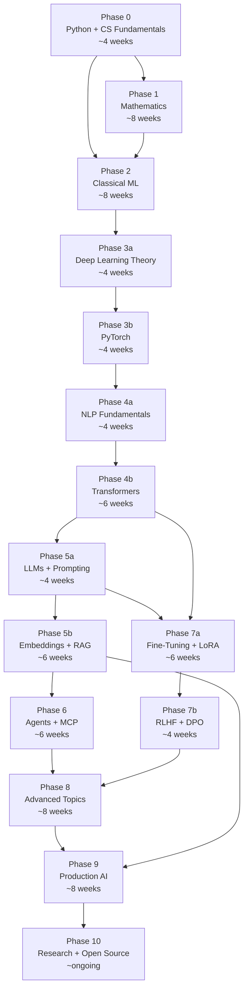
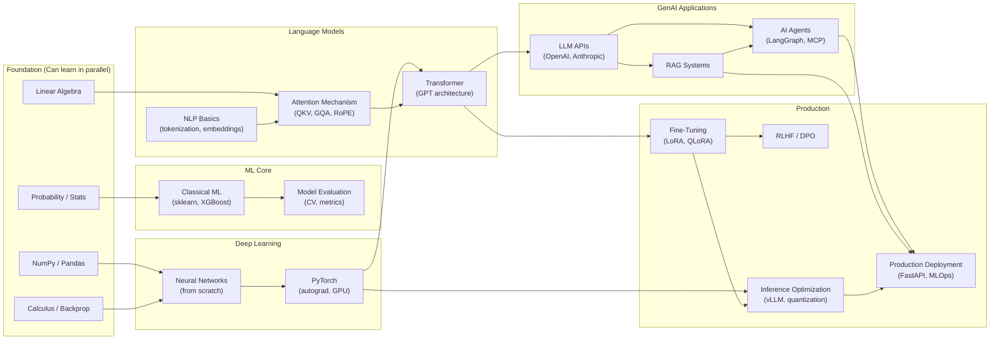
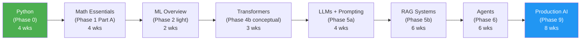
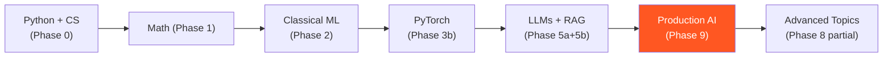
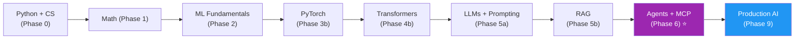
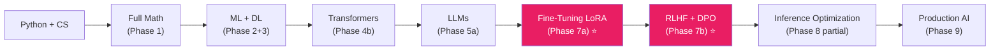
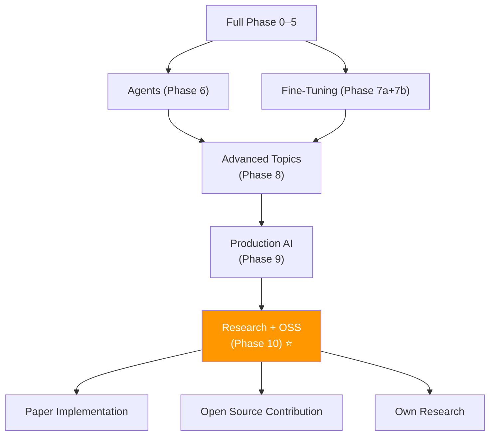

# Learning Graph — Dependency Map
**Visual guide to the GenAI curriculum structure**

> [← Index](./INDEX.md) | Use this to plan alternative paths or understand prerequisites

---

## Core Learning Path



---

## Prerequisite Detail Map



---

## Alternative Learning Paths

### Path 1: LLM App Engineer (Fastest — ~9 months)



**Skip**: Phase 3 (PyTorch deep dive), Phase 7 (fine-tuning), Phase 8 (advanced)
**Best for**: Engineers who want to build LLM applications quickly

---

### Path 2: MLOps / LLMOps Specialist (~12 months)



**Focus on**: MLflow, W&B, LangSmith, CI/CD evaluation, Databricks AI stack, Docker
**Skip**: Phase 7b (RLHF), Phase 10 (research), Phase 6 (deep agent work)

---

### Path 3: AI Agent Specialist (~12 months)



**Focus on**: LangGraph, multi-agent systems, MCP protocol, function calling, tool design
**Projects to prioritize**: 16, 17, 17b, 22

---

### Path 4: Fine-Tuning / Alignment Specialist (~14 months)



**Focus on**: QLoRA, DPO, GPU fundamentals, vLLM, PEFT
**Projects to prioritize**: 9, 18, 19, 21

---

### Path 5: Research Path (~18+ months, full curriculum)



---

## Topic Dependency Detail

### What blocks what (critical dependencies)

| If you skip... | You cannot do... |
|----------------|-----------------|
| Linear algebra (Phase 1) | Understand attention QKV projections |
| Calculus + chain rule (Phase 1) | Understand backpropagation derivation |
| Backpropagation (Phase 3a) | Understand why training fails |
| PyTorch autograd (Phase 3b) | Fine-tune models (Phase 7) |
| Transformer architecture (Phase 4b) | Understand KV cache, GQA, context window tricks |
| RAG fundamentals (Phase 5b) | Build production agents (Phase 6, 9) |
| LoRA math (Phase 7a) | Do RLHF/DPO (Phase 7b) |

### Safe shortcuts (optional topics per path)

| Topic | Required for | Optional if |
|-------|-------------|-------------|
| CNNs (Phase 3b) | Computer vision only | Not doing multimodal |
| Classic NLP (TF-IDF, Word2Vec) (Phase 4a) | Understanding history | You only care about transformers |
| Mixture of Experts (Phase 8) | Research track | Just building apps |
| Speculative decoding (Phase 8) | Inference optimization | Not doing Phase 21 project |
| Paper reading (Phase 10) | Research track | Just building products |

---

## Phase Unlock Gates

You must pass each gate before proceeding (self-assessment quiz ≥ 22/25):

```
Phase 0 → Gate 0: Can implement matrix multiply, write async code, explain Git internals
Phase 1 → Gate 1: Can derive backprop, compute eigendecomposition, explain KL divergence
Phase 2 → Gate 2: Can implement XGBoost pipeline, explain bias-variance, do feature selection
Phase 3 → Gate 3: Can implement transformer attention from scratch in NumPy
Phase 4 → Gate 4: Can build GPT-2 that trains on toy text
Phase 5 → Gate 5: Can build RAG system with evaluation metrics
Phase 6 → Gate 6: Can build multi-agent system with persistent memory
Phase 7 → Gate 7: Can fine-tune LLM with LoRA and measure improvement
Phase 8 → Gate 8: Can run vLLM with quantized model and benchmark throughput
Phase 9 → Gate 9: Can deploy production API with streaming, caching, monitoring
```

---

*[← Index](./INDEX.md) | [Study Schedule](./13_Study_Schedule_18_Months.md)*
